# Appendix Table of Contents

- [Appendix Table of Contents](#appendix-table-of-contents)
- [Appendix E - Results](#appendix-e---results)
  - [Automatic Readings](#automatic-readings)
    - [Profiling](#profiling)
    - [DQ Checks](#dq-checks)
    - [Threshold Validator](#threshold-validator)
    - [Observability](#observability)
      - [Completeness](#completeness)
      - [Tmimeliness](#tmimeliness)
  - [Manual Readings](#manual-readings)
    - [Profiling](#profiling-1)
    - [DQ Checks](#dq-checks-1)
    - [Threshold Validator](#threshold-validator-1)

# Appendix E - Results

## Automatic Readings
### Profiling
YData-Profiling Output for `ANO` variable in automatic reading mode. This is an output that can be checked in the `.html` report generated during Profiling module execution.
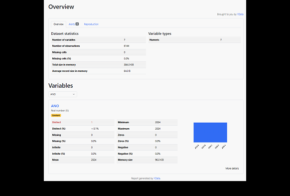
`Ydata-Profiling output for ANO variable in automatic read mode (html)`

YData-Profiling Output for `MES` variable in automatic reading mode. This is an output that can be checked in the `.html` report generated during Profiling module execution.
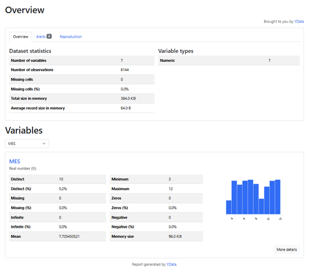
`Ydata-Profiling output for MES variable in automatic read mode (html)`

YData-Profiling Output for `HORA` variable in automatic reading mode. This is an output that can be checked in the `.html` report generated during Profiling module execution.
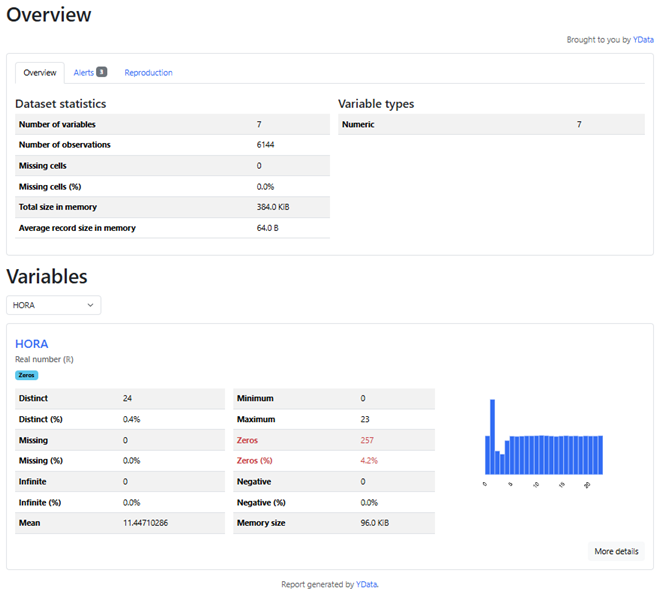
`Ydata-Profiling output for HORA variable in automatic read mode (html)`

YData-Profiling Output for `MINUTO` variable in automatic reading mode. This is an output that can be checked in the `.html` report generated during Profiling module execution.
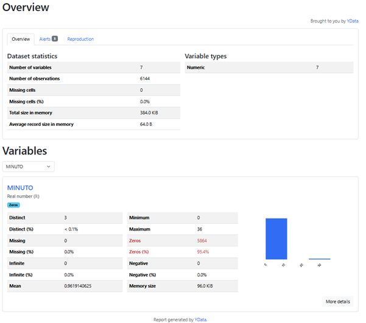
`Ydata-Profiling output for MINUTO variable in automatic read mode (html)`

Data-Profiling Output for `DESLOCARADIALABS` variable in automatic reading mode. This is an output that can be checked in the `.html` report generated during Profiling module execution.
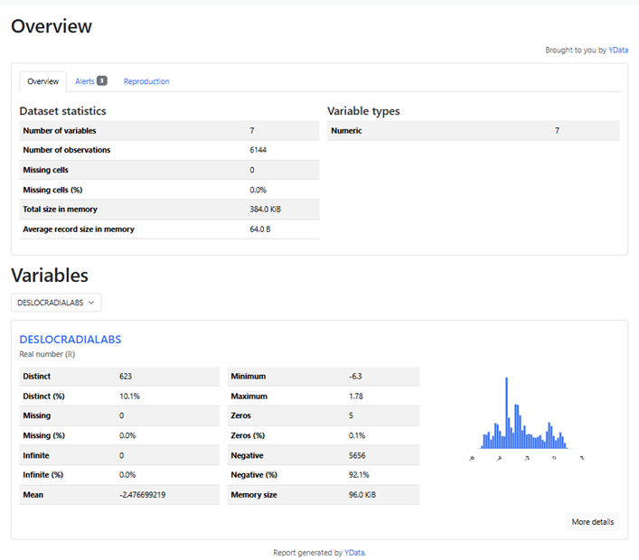
`Ydata-Profiling output for DESLOCARADIALABS variable in automatic read mode (html)`

Data-Profiling Output for `DESLOCARADIALABS` variable in automatic reading mode. This is an output that can be checked in the `.html` report generated during Profiling module execution.
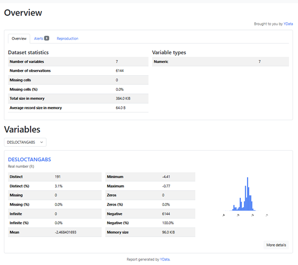
`Ydata-Profiling output for DESLOCARADIALABS variable in automatic read mode (html)`

### DQ Checks
Table below describes all output values for each one of the DQ Checks implemented for **Timeliness** DQ Dimension in automatic read mode.
The `dq_check` column represents the DQ Check and `value` the output calculated value.

| plumbline_id | year | read_mode | dq_dimension | dq_check | value |
| :--- | :--- | :--- | :--- | :--- | :--- |
| 00000 | 2024 | automatic | Timeliness | data_day_density_abs | 20.9 |
| 00000 | 2024 | automatic | Timeliness | data_hour_density_abs | 0.87 |
| 00000 | 2024 | automatic | Timeliness | data_minute_density_abs | 0.01 |
| 00000 | 2024 | automatic | Timeliness | days_apart_previous_record_count_abs | 268.0 |
| 00000 | 2024 | automatic | Timeliness | days_apart_previous_record_proportion_prctg | 0.04 |
| 00000 | 2024 | automatic | Timeliness | hours_apart_previous_record_count_abs | 221.0 |
| 00000 | 2024 | automatic | Timeliness | hours_apart_previous_record_proportion_prctg | 0.04 |
| 00000 | 2024 | automatic | Timeliness | interval_days_abs | 0.28 |
| 00000 | 2024 | automatic | Timeliness | interval_days_prctg | 0.05 |
| 00000 | 2024 | automatic | Timeliness | interval_hours_abs | 4.63 |
| 00000 | 2024 | automatic | Timeliness | interval_hours_prctg | 1.15 |
| 00000 | 2024 | automatic | Timeliness | interval_minutes_abs | 278.04 |
| 00000 | 2024 | automatic | Timeliness | interval_minutes_prctg | 68.81 |
| 00000 | 2024 | automatic | Timeliness | max_gap_days_abs | 13.0 |
| 00000 | 2024 | automatic | Timeliness | max_gap_hours_abs | 308.0 |
| 00000 | 2024 | automatic | Timeliness | max_gap_minutes_abs | 18480.0 |
| 00000 | 2024 | automatic | Timeliness | minutes_apart_previous_record_count_abs | 221.0 |
| 00000 | 2024 | automatic | Timeliness | minutes_apart_previous_record_proportion_prctg | 0.04 |

Next two figures show the different outputs from de DQ Checks calculated and presented in the table above.
It is possible to check the distribution of records (`Value`) for a specific `dq_check`.
While first figure represents “Absolute” DQ Check type, the second represents DQ Checks that are “Percentage” DQ Check type.

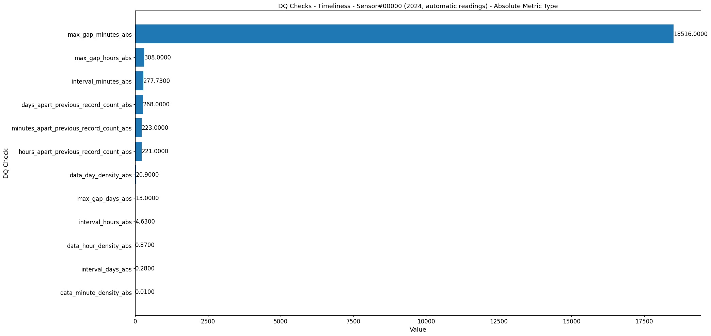
`Data Quality Checks Reporting output for automatic reading mode - Timeliness DQ Dimension (Absolute DQ Check Type)`

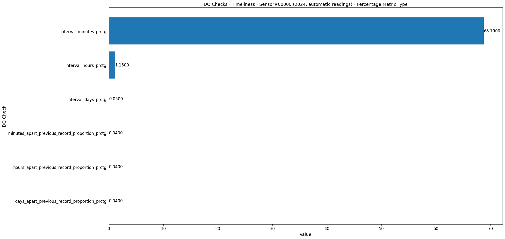
`Data Quality Checks Reporting output for automatic reading mode - Timeliness DQ Dimension (Percentage DQ Check Type)`

### Threshold Validator
Below table represents the `.csv` output file with all the threshold values calculated based on the original command line execution command, in `threshold_validator.py` script.
The output has the column `status` showing the defined Alert Type based on the `value` output calculated column, that represents the `threshold` value calculated.
This `value` column is compared with `threshold` column (value defined in `manual.json` file) and based on the limit factor calculation it raises the Alert type (`status` column).
Additional columns like - `threshold_diff` and `threshold_deviation_pct` are in the file.
The first column represents the absolute difference between `threshold` value allowed and the value calculated, while the second one represents the percentage deviation between `threshold` and calculated threshold value. This value is `100` (meaning 100%) when there is a threshold defined as 0 and a value for the threshold calculated value.

| plumbline_id | year | read_mode | dq_dimension | dq_check | status | value | threshold | threshold_diff | threshold_deviation_pct |
| :--- | :--- | :--- | :--- | :--- | :--- | :--- | :--- | :--- | :--- |
| 00000 | 2024 | automatic | Completeness | hours_with_multiple_records_abs | ALERT | 191.0 | 0.0 | 191.0 | 100.0 |
| 00000 | 2024 | automatic | Completeness | hours_with_multiple_records_prctg | ALERT | 0.03 | 0.0 | 0.03 | 3.0 |
| 00000 | 2024 | automatic | Completeness | redundant_records_hours_abs | ALERT | 252.0 | 0.0 | 252.0 | 100.0 |
| 00000 | 2024 | automatic | Completeness | days_with_multiple_records_abs | OK | 0.0 | 0.0 | 0.0 | 0 |
| 00000 | 2024 | automatic | Completeness | days_with_multiple_records_prctg | OK | 0.0 | 0.0 | 0.0 | 0.0 |
| 00000 | 2024 | automatic | Completeness | minutes_with_multiple_records_abs | OK | 0.0 | 0.0 | 0.0 | 0 |
| 00000 | 2024 | automatic | Completeness | minutes_with_multiple_records_prctg | OK | 0.0 | 0.0 | 0.0 | 0.0 |
| 00000 | 2024 | automatic | Completeness | missing_DESLOCRADIALABS_abs | OK | 0.0 | 0.0 | 0.0 | 0 |
| 00000 | 2024 | automatic | Completeness | missing_DESLOCRADIALABS_prctg | OK | 0.0 | 0.0 | 0.0 | 0.0 |
| 00000 | 2024 | automatic | Completeness | missing_DESLOCTANGABS_abs | OK | 0.0 | 0.0 | 0.0 | 0 |
| 00000 | 2024 | automatic | Completeness | missing_DESLOCTANGABS_prctg | OK | 0.0 | 0.0 | 0.0 | 0.0 |
| 00000 | 2024 | automatic | Completeness | missing_data_day_abs | OK | 0.0 | 0.0 | 0.0 | 0 |
| 00000 | 2024 | automatic | Completeness | missing_data_day_prctg | OK | 0.0 | 0.0 | 0.0 | 0.0 |
| 00000 | 2024 | automatic | Completeness | missing_data_hour_abs | OK | 0.0 | 0.0 | 0.0 | 0 |
| 00000 | 2024 | automatic | Completeness | missing_data_hour_prctg | OK | 0.0 | 0.0 | 0.0 | 0.0 |
| 00000 | 2024 | automatic | Completeness | missing_data_minute_abs | OK | 0.0 | 0.0 | 0.0 | 0 |
| 00000 | 2024 | automatic | Completeness | missing_data_minute_prctg | OK | 0.0 | 0.0 | 0.0 | 0.0 |
| 00000 | 2024 | automatic | Completeness | redundant_records_day_abs | OK | 0.0 | 0.0 | 0.0 | 0 |
| 00000 | 2024 | automatic | Completeness | redundant_records_minutes_abs | OK | 0.0 | 0.0 | 0.0 | 0 |
`Threshold Validator.csv output file for automatic read mode - Completeness DQ Dimension`

Next figure shows the “Percentage” distribution DQ Checks for **Completeness** DQ Dimension in automatic reading mode.

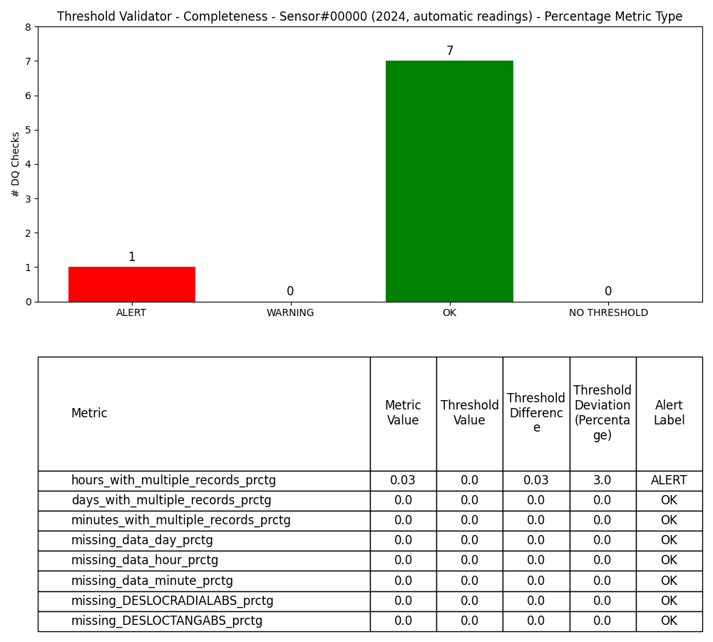
`Threshold Validator.csv output file for automatic read mode - Completeness DQ Dimension_Threshold Validator Reporting output for automatic reading mode - Completeness DQ Dimension (Percentage DQ Check type)_Threshold Validator.csv output file for automatic read mode - Completeness DQ Dimension`

Table below represents the `.csv` output file with all the threshold values calculated based on the original command line execution command, in `threshold_validator.py` script but for **Timeliness** DQ Dimension in automatic reading mode.

| plumbline_id | year | read_mode | dq_dimension | dq_check | status | value | threshold | threshold_diff | threshold_deviation_pct |
| :--- | :--- | :--- | :--- | :--- | :--- | :--- | :--- | :--- | :--- |
| 00000 | 2024 | automatic | Timeliness | days_apart_previous_record_count_abs | ALERT | 268.0 | 1.0 | 267.0 | 26700.0 |
| 00000 | 2024 | automatic | Timeliness | days_apart_previous_record_proportion_prctg | ALERT | 0.04 | 0.0 | 0.04 | 4.0 |
| 00000 | 2024 | automatic | Timeliness | hours_apart_previous_record_count_abs | ALERT | 221.0 | 1.0 | 220.0 | 22000.0 |
| 00000 | 2024 | automatic | Timeliness | hours_apart_previous_record_proportion_prctg | ALERT | 0.04 | 0.0 | 0.04 | 4.0 |
| 00000 | 2024 | automatic | Timeliness | interval_days_prctg | ALERT | 0.05 | 0.0 | 0.05 | 5.0 |
| 00000 | 2024 | automatic | Timeliness | interval_hours_abs | ALERT | 4.63 | 1.0 | 3.63 | 363.0 |
| 00000 | 2024 | automatic | Timeliness | interval_hours_prctg | ALERT | 1.15 | 0.0 | 1.15 | 115.0 |
| 00000 | 2024 | automatic | Timeliness | interval_minutes_abs | ALERT | 278.04 | 60.0 | 218.04 | 363.4 |
| 00000 | 2024 | automatic | Timeliness | interval_minutes_prctg | ALERT | 68.81 | 0.0 | 68.81 | 6881.0 |
| 00000 | 2024 | automatic | Timeliness | max_gap_days_abs | ALERT | 13.0 | 0.0 | 13.0 | 100.0 |
| 00000 | 2024 | automatic | Timeliness | max_gap_hours_abs | ALERT | 308.0 | 0.0 | 308.0 | 100.0 |
| 00000 | 2024 | automatic | Timeliness | max_gap_minutes_abs | ALERT | 18480.0 | 0.0 | 18480.0 | 100.0 |
| 00000 | 2024 | automatic | Timeliness | minutes_apart_previous_record_count_abs | ALERT | 221.0 | 0.0 | 221.0 | 100.0 |
| 00000 | 2024 | automatic | Timeliness | minutes_apart_previous_record_proportion_prctg | ALERT | 0.04 | 0.0 | 0.04 | 4.0 |
| 00000 | 2024 | automatic | Timeliness | data_day_density_abs | OK | 20.9 | 24.0 | 3.1 | -12.92 |
| 00000 | 2024 | automatic | Timeliness | data_hour_density_abs | OK | 0.87 | 1.0 | 0.13 | -13.0 |
| 00000 | 2024 | automatic | Timeliness | data_minute_density_abs | OK | 0.01 | 1.0 | 0.99 | -99.0 |
| 00000 | 2024 | automatic | Timeliness | interval_days_abs | OK | 0.28 | 1.0 | 0.72 | -72.0 |

`Threshold Validator.csv output file for automatic read mode - Completeness DQ Dimension_Threshold Validator.csv output file for automatic read mode - Timeliness DQ Dimension_Threshold Validator.csv output file for automatic read mode - Completeness DQ Dimension`

Below, figures represent the Alert distribution by Alert type. Different visualizations are created accordingly the DQ Check type, allowing the different DQ Check type (Absolute and Percentage) to be analysed in their specific report. Both figures apply to automatic read mode for **Timeliness** DQ Dimension.

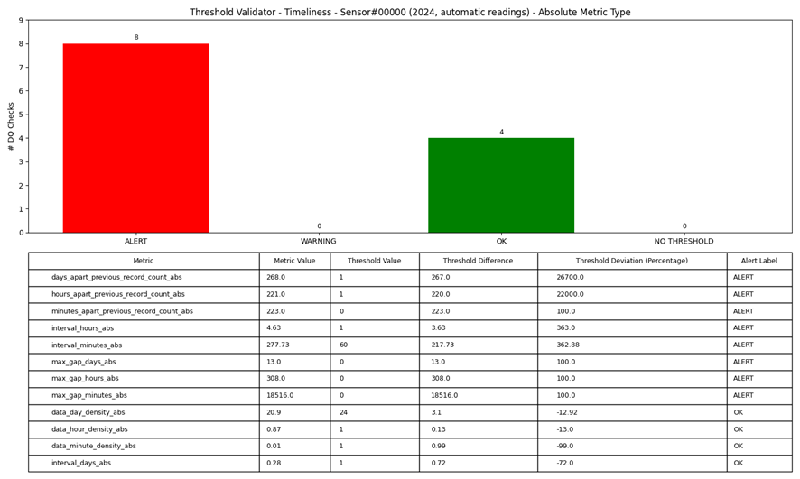
`Threshold Validator.csv output file for automatic read mode – Completeness DQ Dimension_Threshold Validator Reporting output for automatic reading mode - Timeliness DQ Dimension (Absolute DQ Check type)_Threshold Validator.csv output file for automatic read mode – Completeness DQ Dimension__Threshold Validator.csv output file for automatic read mode – Completeness DQ Dimension`

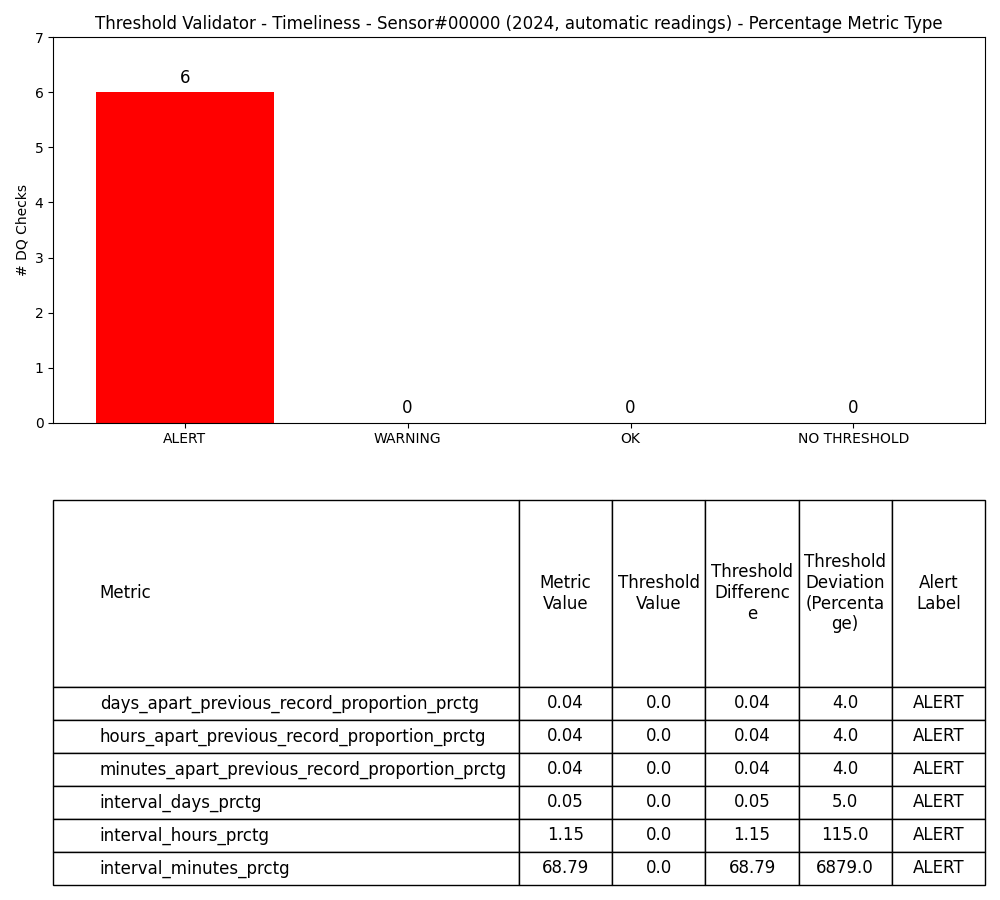
`Threshold Validator.csv output file for automatic read mode – Completeness DQ Dimension\_Threshold Validator Reporting output for automatic reading mode - Timeliness DQ Dimension (Percentage DQ Check type)\_Threshold Validator.csv output file for automatic read mode – Completeness DQ Dimension`

### Observability
Next sections show the outputs for the Observability Layer.
Because the results might be too long, all tables are hidden wihtin a proper section.
#### Completeness
- DQ Check - `hours with multiple records abs`

&nbsp;&nbsp;&nbsp;&nbsp;&nbsp;&nbsp;Click to show/hide results table

| ANO | MES | DIA | HORA | MINUTO | DESLOCRADIALABS | DESLOCTANGABS |
| :--- | :--- | :--- | :--- | :--- | :--- | :--- |
| 2024 | 3 | 14 | 18 | 0 | -5.04 | -2.29 |
| 2024 | 3 | 14 | 18 | 36 | -5.09 | -2.28 |
| 2024 | 3 | 20 | 15 | 0 | -4.53 | -2.02 |
| 2024 | 3 | 20 | 15 | 36 | -4.3 | -2.07 |
| 2024 | 3 | 21 | 8 | 0 | -4.48 | -2.18 |
| 2024 | 3 | 21 | 8 | 6 | -4.44 | -2.32 |
| 2024 | 3 | 26 | 1 | 0 | -4.4 | -2.07 |
| 2024 | 3 | 26 | 1 | 36 | -4.24 | -2.15 |
| 2024 | 3 | 31 | 0 | 0 | -5.07 | -2.03 |
| 2024 | 3 | 31 | 0 | 36 | -5.06 | -2.17 |
| 2024 | 4 | 1 | 1 | 0 | -4.91 | -2.33 |
| 2024 | 4 | 1 | 1 | 6 | -5.11 | -2.37 |
| 2024 | 4 | 1 | 1 | 36 | -4.94 | -2.24 |
| 2024 | 4 | 2 | 1 | 0 | -5.0 | -2.3 |
| 2024 | 4 | 2 | 1 | 6 | -4.98 | -2.3 |
| 2024 | 4 | 2 | 1 | 36 | -5.01 | -2.24 |
| 2024 | 4 | 3 | 1 | 0 | -5.11 | -2.42 |
| 2024 | 4 | 3 | 1 | 6 | -5.13 | -2.38 |
| 2024 | 4 | 4 | 1 | 0 | -5.16 | -2.25 |
| 2024 | 4 | 4 | 1 | 6 | -5.17 | -2.32 |
| 2024 | 4 | 4 | 1 | 36 | -5.22 | -2.21 |
| 2024 | 4 | 5 | 1 | 0 | -5.04 | -2.29 |
| 2024 | 4 | 5 | 1 | 36 | -5.02 | -2.32 |
| 2024 | 4 | 6 | 1 | 0 | -4.8 | -2.21 |
| 2024 | 4 | 6 | 1 | 36 | -4.85 | -2.12 |
| 2024 | 4 | 7 | 1 | 0 | -5.06 | -2.18 |
| 2024 | 4 | 7 | 1 | 36 | -5.1 | -2.13 |
| 2024 | 4 | 8 | 1 | 0 | -4.79 | -2.0 |
| 2024 | 4 | 8 | 1 | 36 | -4.93 | -2.4 |
| 2024 | 4 | 9 | 1 | 0 | -4.85 | -2.22 |
| 2024 | 4 | 9 | 1 | 36 | -4.85 | -2.23 |
| 2024 | 4 | 11 | 1 | 0 | -4.76 | -2.23 |
| 2024 | 4 | 11 | 1 | 36 | -4.73 | -2.23 |
| 2024 | 4 | 12 | 1 | 0 | -4.49 | -2.12 |
| 2024 | 4 | 12 | 1 | 36 | -4.49 | -2.16 |
| 2024 | 4 | 13 | 1 | 0 | -4.44 | -2.12 |
| 2024 | 4 | 13 | 1 | 36 | -4.41 | -2.19 |
| 2024 | 4 | 14 | 1 | 0 | -4.36 | -2.12 |
| 2024 | 4 | 14 | 1 | 36 | -4.36 | -2.16 |
| 2024 | 4 | 15 | 1 | 0 | -4.25 | -2.14 |
| 2024 | 4 | 15 | 1 | 36 | -4.28 | -2.21 |
| 2024 | 4 | 16 | 1 | 0 | -4.1 | -2.12 |
| 2024 | 4 | 16 | 1 | 36 | -4.14 | -2.09 |
| 2024 | 4 | 17 | 1 | 0 | -4.06 | -2.22 |
| 2024 | 4 | 17 | 1 | 36 | -4.07 | -2.12 |
| 2024 | 4 | 18 | 1 | 0 | -4.05 | -2.18 |
| 2024 | 4 | 18 | 1 | 36 | -4.05 | -2.1 |
| 2024 | 4 | 19 | 1 | 0 | -3.92 | -2.13 |
| 2024 | 4 | 19 | 1 | 36 | -3.95 | -2.13 |
| 2024 | 4 | 20 | 1 | 0 | -3.83 | -2.21 |
| 2024 | 4 | 20 | 1 | 36 | -3.82 | -2.12 |
| 2024 | 4 | 21 | 1 | 0 | -3.53 | -2.21 |
| 2024 | 4 | 21 | 1 | 36 | -3.58 | -2.17 |
| 2024 | 4 | 22 | 1 | 0 | -3.33 | -2.23 |
| 2024 | 4 | 22 | 1 | 36 | -3.38 | -2.24 |
| 2024 | 4 | 23 | 1 | 0 | -3.41 | -2.21 |
| 2024 | 4 | 23 | 1 | 36 | -3.45 | -2.26 |
| 2024 | 4 | 24 | 1 | 0 | -3.5 | -2.23 |
| 2024 | 4 | 24 | 1 | 36 | -3.5 | -2.18 |
| 2024 | 4 | 25 | 1 | 0 | -3.48 | -2.22 |
| 2024 | 4 | 25 | 1 | 36 | -3.53 | -2.25 |
| 2024 | 4 | 26 | 1 | 0 | -3.79 | -2.16 |
| 2024 | 4 | 26 | 1 | 36 | -3.72 | -2.31 |
| 2024 | 4 | 27 | 1 | 0 | -4.07 | -2.1 |
| 2024 | 4 | 27 | 1 | 36 | -4.13 | -1.99 |
| 2024 | 4 | 28 | 1 | 0 | -4.38 | -2.12 |
| 2024 | 4 | 28 | 1 | 36 | -4.38 | -2.12 |
| 2024 | 4 | 29 | 1 | 0 | -4.32 | -2.14 |
| 2024 | 4 | 29 | 1 | 36 | -4.34 | -2.08 |
| 2024 | 4 | 30 | 1 | 0 | -4.13 | -2.15 |
| 2024 | 4 | 30 | 1 | 36 | -4.15 | -2.23 |
| 2024 | 5 | 1 | 1 | 0 | -4.22 | -2.06 |
| 2024 | 5 | 1 | 1 | 36 | -4.2 | -2.06 |
| 2024 | 5 | 2 | 1 | 0 | -4.26 | -2.15 |
| 2024 | 5 | 2 | 1 | 36 | -4.29 | -2.1 |
| 2024 | 5 | 3 | 1 | 0 | -4.38 | -2.23 |
| 2024 | 5 | 3 | 1 | 36 | -4.43 | -2.19 |
| 2024 | 5 | 4 | 1 | 0 | -4.22 | -2.25 |
| 2024 | 5 | 4 | 1 | 36 | -4.38 | -2.22 |
| 2024 | 5 | 5 | 1 | 0 | -4.23 | -2.04 |
| 2024 | 5 | 5 | 1 | 36 | -4.19 | -2.12 |
| 2024 | 5 | 6 | 1 | 0 | -4.24 | -2.04 |
| 2024 | 5 | 6 | 1 | 36 | -4.24 | -2.13 |
| 2024 | 5 | 7 | 1 | 0 | -4.28 | -2.04 |
| 2024 | 5 | 7 | 1 | 36 | -4.26 | -2.11 |
| 2024 | 5 | 8 | 1 | 0 | -4.12 | -2.08 |
| 2024 | 5 | 8 | 1 | 36 | -4.17 | -2.14 |
| 2024 | 5 | 9 | 1 | 0 | -4.01 | -2.06 |
| 2024 | 5 | 9 | 1 | 36 | -4.03 | -2.08 |
| 2024 | 5 | 10 | 1 | 0 | -4.08 | -2.05 |
| 2024 | 5 | 10 | 1 | 36 | -4.1 | -2.06 |
| 2024 | 5 | 11 | 1 | 0 | -3.86 | -2.09 |
| 2024 | 5 | 11 | 1 | 36 | -3.82 | -2.16 |
| 2024 | 5 | 12 | 1 | 0 | -3.88 | -2.08 |
| 2024 | 5 | 12 | 1 | 36 | -3.88 | -2.08 |
| 2024 | 5 | 13 | 1 | 0 | -3.73 | -2.13 |
| 2024 | 5 | 13 | 1 | 36 | -3.77 | -2.09 |
| 2024 | 5 | 14 | 1 | 0 | -3.7 | -2.08 |
| 2024 | 5 | 14 | 1 | 36 | -3.73 | -2.04 |
| 2024 | 5 | 15 | 1 | 0 | -3.57 | -2.09 |
| 2024 | 5 | 15 | 1 | 36 | -3.55 | -2.08 |
| 2024 | 5 | 16 | 1 | 0 | -3.62 | -2.13 |
| 2024 | 5 | 16 | 1 | 36 | -3.67 | -2.06 |
| 2024 | 5 | 17 | 1 | 0 | -3.84 | -2.11 |
| 2024 | 5 | 17 | 1 | 36 | -3.84 | -2.16 |
| 2024 | 5 | 18 | 1 | 0 | -3.97 | -2.1 |
| 2024 | 5 | 18 | 1 | 6 | -3.96 | -2.12 |
| 2024 | 5 | 18 | 1 | 36 | -3.98 | -2.09 |
| 2024 | 5 | 19 | 1 | 0 | -4.18 | -2.13 |
| 2024 | 5 | 19 | 1 | 6 | -4.17 | -2.07 |
| 2024 | 5 | 19 | 1 | 36 | -4.24 | -2.14 |
| 2024 | 5 | 20 | 1 | 0 | -4.12 | -2.06 |
| 2024 | 5 | 20 | 1 | 6 | -4.12 | -2.06 |
| 2024 | 5 | 20 | 1 | 36 | -4.14 | -1.97 |
| 2024 | 5 | 21 | 1 | 0 | -4.09 | -2.1 |
| 2024 | 5 | 21 | 1 | 6 | -4.08 | -2.12 |
| 2024 | 5 | 22 | 1 | 0 | -4.08 | -2.12 |
| 2024 | 5 | 22 | 1 | 6 | -4.08 | -2.02 |
| 2024 | 5 | 23 | 1 | 0 | -3.97 | -2.07 |
| 2024 | 5 | 23 | 1 | 6 | -3.95 | -2.2 |
| 2024 | 5 | 23 | 1 | 36 | -3.98 | -2.16 |
| 2024 | 5 | 23 | 9 | 0 | -4.16 | -2.0 |
| 2024 | 5 | 23 | 9 | 36 | -4.16 | -2.13 |
| 2024 | 5 | 23 | 12 | 0 | -4.15 | -2.08 |
| 2024 | 5 | 23 | 12 | 6 | -4.1 | -2.15 |
| 2024 | 5 | 27 | 1 | 0 | -3.16 | -2.47 |
| 2024 | 5 | 27 | 1 | 36 | -3.17 | -2.08 |
| 2024 | 5 | 28 | 1 | 0 | -3.34 | -2.26 |
| 2024 | 5 | 28 | 1 | 36 | -3.36 | -2.16 |
| 2024 | 5 | 30 | 1 | 0 | -2.9 | -2.21 |
| 2024 | 5 | 30 | 1 | 36 | -2.9 | -2.19 |
| 2024 | 5 | 31 | 1 | 0 | -2.64 | -2.35 |
| 2024 | 5 | 31 | 1 | 36 | -2.63 | -2.23 |
| 2024 | 6 | 1 | 1 | 0 | -2.77 | -2.3 |
| 2024 | 6 | 1 | 1 | 6 | -2.74 | -2.37 |
| 2024 | 6 | 1 | 1 | 36 | -2.74 | -3.17 |
| 2024 | 6 | 2 | 1 | 0 | -2.69 | -2.5 |
| 2024 | 6 | 2 | 1 | 6 | -2.7 | -2.51 |
| 2024 | 6 | 2 | 1 | 36 | -2.69 | -2.49 |
| 2024 | 6 | 3 | 1 | 0 | -2.47 | -2.21 |
| 2024 | 6 | 3 | 1 | 6 | -2.42 | -2.28 |
| 2024 | 6 | 3 | 1 | 36 | -2.45 | -2.21 |
| 2024 | 6 | 4 | 1 | 0 | -2.44 | -2.28 |
| 2024 | 6 | 4 | 1 | 6 | -2.44 | -2.28 |
| 2024 | 6 | 4 | 1 | 36 | -2.45 | -2.26 |
| 2024 | 6 | 5 | 1 | 0 | -2.66 | -2.3 |
| 2024 | 6 | 5 | 1 | 6 | -2.66 | -2.3 |
| 2024 | 6 | 5 | 1 | 36 | -2.67 | -2.31 |
| 2024 | 6 | 6 | 1 | 0 | -2.54 | -2.27 |
| 2024 | 6 | 6 | 1 | 6 | -2.54 | -2.33 |
| 2024 | 6 | 6 | 1 | 36 | -2.56 | -2.33 |
| 2024 | 6 | 7 | 1 | 0 | -2.49 | -2.32 |
| 2024 | 6 | 7 | 1 | 6 | -2.52 | -2.32 |
| 2024 | 6 | 8 | 1 | 0 | -2.53 | -2.32 |
| 2024 | 6 | 8 | 1 | 6 | -2.54 | -2.33 |
| 2024 | 6 | 8 | 1 | 36 | -2.55 | -2.33 |
| 2024 | 6 | 9 | 1 | 0 | -2.74 | -2.28 |
| 2024 | 6 | 9 | 1 | 6 | -2.75 | -2.29 |
| 2024 | 6 | 10 | 1 | 0 | -2.85 | -2.3 |
| 2024 | 6 | 10 | 1 | 6 | -2.85 | -2.3 |
| 2024 | 6 | 11 | 1 | 0 | -2.7 | -2.32 |
| 2024 | 6 | 11 | 1 | 6 | -2.67 | -2.33 |
| 2024 | 6 | 11 | 1 | 36 | -2.71 | -2.33 |
| 2024 | 6 | 12 | 1 | 0 | -2.6 | -2.4 |
| 2024 | 6 | 12 | 1 | 6 | -2.64 | -2.3 |
| 2024 | 6 | 13 | 1 | 0 | -2.59 | -2.33 |
| 2024 | 6 | 13 | 1 | 6 | -2.59 | -2.33 |
| 2024 | 6 | 13 | 1 | 36 | -2.61 | -2.33 |
| 2024 | 6 | 14 | 1 | 0 | -2.53 | -2.37 |
| 2024 | 6 | 14 | 1 | 6 | -2.53 | -2.39 |
| 2024 | 6 | 14 | 1 | 36 | -2.55 | -2.37 |
| 2024 | 6 | 15 | 1 | 0 | -2.52 | -2.37 |
| 2024 | 6 | 15 | 1 | 6 | -2.53 | -2.36 |
| 2024 | 6 | 15 | 1 | 36 | -2.54 | -2.35 |
| 2024 | 6 | 16 | 1 | 0 | -2.36 | -2.35 |
| 2024 | 6 | 16 | 1 | 6 | -2.36 | -2.35 |
| 2024 | 6 | 16 | 1 | 36 | -2.37 | -2.36 |
| 2024 | 6 | 17 | 1 | 0 | -2.24 | -2.39 |
| 2024 | 6 | 17 | 1 | 6 | -2.25 | -2.39 |
| 2024 | 6 | 17 | 1 | 36 | -2.27 | -2.39 |
| 2024 | 6 | 18 | 1 | 0 | -2.42 | -2.4 |
| 2024 | 6 | 18 | 1 | 6 | -2.42 | -2.39 |
| 2024 | 6 | 18 | 1 | 36 | -2.44 | -2.39 |
| 2024 | 6 | 19 | 1 | 0 | -2.59 | -2.34 |
| 2024 | 6 | 19 | 1 | 6 | -2.6 | -2.4 |
| 2024 | 6 | 19 | 1 | 36 | -2.54 | -2.34 |
| 2024 | 6 | 20 | 1 | 0 | -2.79 | -2.3 |
| 2024 | 6 | 20 | 1 | 6 | -2.79 | -2.28 |
| 2024 | 6 | 21 | 1 | 0 | -2.73 | -2.29 |
| 2024 | 6 | 21 | 1 | 6 | -2.77 | -2.3 |
| 2024 | 6 | 21 | 1 | 36 | -2.75 | -2.29 |
| 2024 | 6 | 22 | 1 | 0 | -2.58 | -2.32 |
| 2024 | 6 | 22 | 1 | 6 | -2.56 | -2.32 |
| 2024 | 6 | 23 | 1 | 0 | -2.51 | -2.33 |
| 2024 | 6 | 23 | 1 | 6 | -2.53 | -2.33 |
| 2024 | 6 | 23 | 1 | 36 | -2.53 | -2.33 |
| 2024 | 6 | 24 | 1 | 0 | -2.18 | -2.4 |
| 2024 | 6 | 24 | 1 | 6 | -2.18 | -2.4 |
| 2024 | 6 | 24 | 1 | 36 | -2.18 | -2.4 |
| 2024 | 6 | 25 | 1 | 0 | -1.85 | -2.5 |
| 2024 | 6 | 25 | 1 | 6 | -1.85 | -2.52 |
| 2024 | 6 | 25 | 1 | 36 | -1.85 | -2.5 |
| 2024 | 6 | 26 | 1 | 0 | -1.67 | -2.57 |
| 2024 | 6 | 26 | 1 | 6 | -1.7 | -2.57 |
| 2024 | 6 | 26 | 1 | 36 | -1.68 | -2.56 |
| 2024 | 6 | 27 | 1 | 0 | -1.66 | -2.55 |
| 2024 | 6 | 27 | 1 | 6 | -1.66 | -2.56 |
| 2024 | 6 | 27 | 1 | 36 | -1.71 | -2.55 |
| 2024 | 6 | 28 | 1 | 0 | -1.94 | -2.4 |
| 2024 | 6 | 28 | 1 | 6 | -1.95 | -2.4 |
| 2024 | 6 | 29 | 1 | 0 | -2.26 | -2.34 |
| 2024 | 6 | 29 | 1 | 6 | -2.27 | -2.33 |
| 2024 | 6 | 29 | 1 | 36 | -2.26 | -2.33 |
| 2024 | 6 | 30 | 1 | 0 | -2.33 | -2.3 |
| 2024 | 6 | 30 | 1 | 36 | -2.32 | -2.3 |
| 2024 | 7 | 1 | 1 | 0 | -2.16 | -2.3 |
| 2024 | 7 | 1 | 1 | 36 | -2.18 | -2.3 |
| 2024 | 7 | 2 | 1 | 0 | -2.02 | -2.32 |
| 2024 | 7 | 2 | 1 | 36 | -2.06 | -2.32 |
| 2024 | 7 | 3 | 1 | 0 | -1.92 | -2.39 |
| 2024 | 7 | 3 | 1 | 36 | -1.92 | -2.37 |
| 2024 | 7 | 4 | 1 | 0 | -1.82 | -2.47 |
| 2024 | 7 | 4 | 1 | 36 | -1.83 | -2.47 |
| 2024 | 7 | 5 | 1 | 0 | -1.71 | -2.52 |
| 2024 | 7 | 5 | 1 | 36 | -1.71 | -2.54 |
| 2024 | 7 | 6 | 1 | 0 | -1.54 | -2.59 |
| 2024 | 7 | 6 | 1 | 36 | -1.54 | -2.61 |
| 2024 | 7 | 7 | 1 | 0 | -1.54 | -2.56 |
| 2024 | 7 | 7 | 1 | 36 | -1.54 | -2.57 |
| 2024 | 7 | 8 | 1 | 0 | -1.42 | -2.61 |
| 2024 | 7 | 8 | 1 | 36 | -1.42 | -2.57 |
| 2024 | 7 | 9 | 1 | 0 | -1.34 | -2.59 |
| 2024 | 7 | 9 | 1 | 36 | -1.27 | -2.57 |
| 2024 | 7 | 10 | 1 | 0 | -1.34 | -2.53 |
| 2024 | 7 | 10 | 1 | 6 | -1.35 | -2.51 |
| 2024 | 7 | 11 | 1 | 0 | -1.18 | -2.52 |
| 2024 | 7 | 11 | 1 | 6 | -1.18 | -2.51 |
| 2024 | 7 | 11 | 1 | 36 | -1.19 | -2.52 |
| 2024 | 7 | 12 | 1 | 0 | -1.09 | -2.53 |
| 2024 | 7 | 12 | 1 | 6 | -1.11 | -2.55 |
| 2024 | 7 | 13 | 1 | 0 | -1.05 | -2.57 |
| 2024 | 7 | 13 | 1 | 6 | -1.04 | -2.58 |
| 2024 | 7 | 14 | 1 | 0 | -0.87 | -2.59 |
| 2024 | 7 | 14 | 1 | 6 | -0.9 | -2.63 |
| 2024 | 7 | 15 | 1 | 0 | -0.76 | -2.61 |
| 2024 | 7 | 15 | 1 | 6 | -0.9 | -2.63 |
| 2024 | 7 | 15 | 1 | 36 | -0.85 | -2.61 |
| 2024 | 7 | 16 | 1 | 0 | -1.02 | -2.57 |
| 2024 | 7 | 16 | 1 | 6 | -1.04 | -2.59 |
| 2024 | 7 | 16 | 1 | 36 | -1.04 | -2.58 |
| 2024 | 7 | 17 | 1 | 0 | -1.17 | -2.64 |
| 2024 | 7 | 17 | 1 | 6 | -1.16 | -2.64 |
| 2024 | 7 | 17 | 1 | 36 | -1.18 | -2.64 |
| 2024 | 7 | 18 | 1 | 0 | -1.12 | -2.67 |
| 2024 | 7 | 18 | 1 | 6 | -1.12 | -2.67 |
| 2024 | 7 | 18 | 1 | 36 | -1.14 | -2.67 |
| 2024 | 7 | 19 | 1 | 0 | -1.03 | -2.71 |
| 2024 | 7 | 19 | 1 | 6 | -1.04 | -2.72 |
| 2024 | 7 | 19 | 1 | 36 | -1.05 | -2.74 |
| 2024 | 7 | 20 | 1 | 0 | -0.9 | -2.79 |
| 2024 | 7 | 20 | 1 | 6 | -0.91 | -2.79 |
| 2024 | 7 | 20 | 1 | 36 | -0.92 | -2.79 |
| 2024 | 7 | 21 | 1 | 0 | -0.97 | -2.79 |
| 2024 | 7 | 21 | 1 | 6 | -0.99 | -2.79 |
| 2024 | 7 | 21 | 1 | 36 | -0.99 | -2.8 |
| 2024 | 7 | 22 | 1 | 0 | -0.96 | -2.72 |
| 2024 | 7 | 22 | 1 | 6 | -0.97 | -2.74 |
| 2024 | 7 | 22 | 1 | 36 | -0.96 | -2.74 |
| 2024 | 7 | 23 | 1 | 0 | -0.82 | -2.79 |
| 2024 | 7 | 23 | 1 | 6 | -0.81 | -2.81 |
| 2024 | 7 | 23 | 1 | 36 | -0.84 | -2.82 |
| 2024 | 7 | 24 | 1 | 0 | -0.6 | -2.88 |
| 2024 | 7 | 24 | 1 | 6 | -0.59 | -2.86 |
| 2024 | 7 | 24 | 1 | 36 | -0.61 | -2.86 |
| 2024 | 7 | 25 | 1 | 0 | -0.41 | -2.98 |
| 2024 | 7 | 25 | 1 | 6 | -0.41 | -2.93 |
| 2024 | 7 | 25 | 1 | 36 | -0.43 | -2.92 |
| 2024 | 7 | 26 | 1 | 0 | -0.3 | -3.11 |
| 2024 | 7 | 26 | 1 | 6 | -0.28 | -3.09 |
| 2024 | 7 | 27 | 1 | 0 | -0.44 | -2.73 |
| 2024 | 7 | 27 | 1 | 6 | -0.41 | -2.74 |
| 2024 | 7 | 28 | 1 | 0 | -0.39 | -2.79 |
| 2024 | 7 | 28 | 1 | 6 | -0.39 | -2.79 |
| 2024 | 7 | 29 | 1 | 0 | -0.26 | -2.82 |
| 2024 | 7 | 29 | 1 | 6 | -0.29 | -2.84 |
| 2024 | 7 | 30 | 1 | 0 | -0.49 | -2.85 |
| 2024 | 7 | 30 | 1 | 36 | -0.5 | -2.79 |
| 2024 | 7 | 31 | 1 | 0 | -0.39 | -2.77 |
| 2024 | 7 | 31 | 1 | 6 | -0.4 | -2.79 |
| 2024 | 8 | 1 | 1 | 0 | -0.23 | -2.82 |
| 2024 | 8 | 1 | 1 | 6 | -0.26 | -2.8 |
| 2024 | 8 | 2 | 1 | 0 | -0.33 | -2.77 |
| 2024 | 8 | 2 | 1 | 6 | -0.35 | -2.79 |
| 2024 | 8 | 3 | 1 | 0 | -0.27 | -2.75 |
| 2024 | 8 | 3 | 1 | 6 | -0.33 | -2.76 |
| 2024 | 8 | 4 | 1 | 0 | -0.17 | -2.82 |
| 2024 | 8 | 4 | 1 | 6 | -0.16 | -2.82 |
| 2024 | 8 | 5 | 1 | 0 | -0.11 | -2.89 |
| 2024 | 8 | 5 | 1 | 6 | -0.11 | -2.85 |
| 2024 | 8 | 6 | 1 | 0 | -0.11 | -2.84 |
| 2024 | 8 | 6 | 1 | 6 | -0.09 | -2.82 |
| 2024 | 8 | 7 | 1 | 0 | -0.11 | -2.89 |
| 2024 | 8 | 7 | 1 | 6 | -0.11 | -2.88 |
| 2024 | 8 | 8 | 1 | 0 | 0.06 | -2.96 |
| 2024 | 8 | 8 | 1 | 6 | 0.02 | -2.96 |
| 2024 | 8 | 9 | 1 | 0 | 0.19 | -2.97 |
| 2024 | 8 | 9 | 1 | 6 | 0.19 | -2.98 |
| 2024 | 8 | 10 | 1 | 0 | 0.33 | -3.11 |
| 2024 | 8 | 10 | 1 | 6 | 0.31 | -3.1 |
| 2024 | 8 | 11 | 1 | 0 | 0.63 | -3.07 |
| 2024 | 8 | 11 | 1 | 6 | 0.53 | -3.1 |
| 2024 | 8 | 12 | 1 | 0 | 0.55 | -3.15 |
| 2024 | 8 | 12 | 1 | 6 | 0.58 | -3.19 |
| 2024 | 8 | 13 | 1 | 0 | 0.5 | -3.25 |
| 2024 | 8 | 13 | 1 | 6 | 0.48 | -3.21 |
| 2024 | 8 | 14 | 1 | 0 | 0.35 | -3.17 |
| 2024 | 8 | 14 | 1 | 6 | 0.34 | -3.15 |
| 2024 | 8 | 15 | 1 | 0 | 0.28 | -3.2 |
| 2024 | 8 | 15 | 1 | 6 | 0.26 | -3.22 |
| 2024 | 8 | 16 | 1 | 0 | 0.18 | -3.21 |
| 2024 | 8 | 16 | 1 | 6 | 0.2 | -3.18 |
| 2024 | 8 | 17 | 1 | 0 | 0.41 | -3.23 |
| 2024 | 8 | 17 | 1 | 6 | 0.41 | -3.22 |
| 2024 | 8 | 18 | 1 | 0 | 0.45 | -3.21 |
| 2024 | 8 | 18 | 1 | 6 | 0.44 | -3.22 |
| 2024 | 8 | 19 | 1 | 0 | 0.53 | -3.28 |
| 2024 | 8 | 19 | 1 | 6 | 0.54 | -3.27 |
| 2024 | 8 | 20 | 1 | 0 | 0.58 | -3.29 |
| 2024 | 8 | 20 | 1 | 6 | 0.6 | -3.28 |
| 2024 | 8 | 21 | 1 | 0 | 0.6 | -3.32 |
| 2024 | 8 | 21 | 1 | 6 | 0.63 | -3.31 |
| 2024 | 8 | 22 | 1 | 0 | 0.65 | -3.31 |
| 2024 | 8 | 22 | 1 | 6 | 0.64 | -3.31 |
| 2024 | 8 | 23 | 1 | 0 | 0.41 | -3.26 |
| 2024 | 8 | 23 | 1 | 6 | 0.44 | -3.28 |
| 2024 | 8 | 24 | 1 | 0 | 0.47 | -3.26 |
| 2024 | 8 | 24 | 1 | 6 | 0.46 | -3.27 |
| 2024 | 8 | 25 | 1 | 0 | 0.46 | -3.27 |
| 2024 | 8 | 25 | 1 | 6 | 0.48 | -3.27 |
| 2024 | 8 | 26 | 1 | 0 | 0.58 | -3.25 |
| 2024 | 8 | 26 | 1 | 6 | 0.55 | -3.28 |
| 2024 | 8 | 26 | 11 | 0 | 0.46 | -3.3 |
| 2024 | 8 | 26 | 11 | 36 | 0.47 | -3.28 |
| 2024 | 8 | 31 | 1 | 0 | -0.03 | -2.9 |
| 2024 | 8 | 31 | 1 | 6 | -0.05 | -2.91 |
| 2024 | 8 | 31 | 1 | 36 | -0.07 | -2.91 |
| 2024 | 9 | 1 | 1 | 0 | -0.11 | -2.88 |
| 2024 | 9 | 1 | 1 | 6 | -0.2 | -2.88 |
| 2024 | 9 | 1 | 1 | 36 | 0.05 | -2.98 |
| 2024 | 9 | 2 | 1 | 0 | -0.12 | -2.85 |
| 2024 | 9 | 2 | 1 | 6 | -0.12 | -2.86 |
| 2024 | 9 | 2 | 1 | 36 | -0.12 | -2.87 |
| 2024 | 9 | 3 | 1 | 0 | -0.3 | -2.88 |
| 2024 | 9 | 3 | 1 | 6 | -0.31 | -2.85 |
| 2024 | 9 | 3 | 1 | 36 | -0.32 | -2.89 |
| 2024 | 9 | 4 | 1 | 0 | -0.28 | -2.87 |
| 2024 | 9 | 4 | 1 | 6 | -0.25 | -2.86 |
| 2024 | 9 | 4 | 1 | 36 | -0.27 | -2.88 |
| 2024 | 9 | 5 | 1 | 0 | -0.23 | -2.85 |
| 2024 | 9 | 5 | 1 | 6 | -0.24 | -2.85 |
| 2024 | 9 | 5 | 1 | 36 | -0.3 | -2.86 |
| 2024 | 9 | 6 | 1 | 0 | -0.4 | -2.82 |
| 2024 | 9 | 6 | 1 | 6 | -0.4 | -2.79 |
| 2024 | 9 | 6 | 1 | 36 | -0.4 | -2.83 |
| 2024 | 9 | 7 | 1 | 0 | -0.51 | -2.8 |
| 2024 | 9 | 7 | 1 | 6 | -0.49 | -2.83 |
| 2024 | 9 | 7 | 1 | 36 | -0.54 | -2.8 |
| 2024 | 9 | 8 | 1 | 0 | -0.54 | -2.77 |
| 2024 | 9 | 8 | 1 | 6 | -0.55 | -2.78 |
| 2024 | 9 | 8 | 1 | 36 | -0.58 | -2.8 |
| 2024 | 9 | 9 | 1 | 0 | -0.52 | -2.79 |
| 2024 | 9 | 9 | 1 | 6 | -0.5 | -2.76 |
| 2024 | 9 | 9 | 1 | 36 | -0.53 | -2.79 |
| 2024 | 9 | 10 | 1 | 0 | -0.45 | -2.79 |
| 2024 | 9 | 10 | 1 | 6 | -0.48 | -2.79 |
| 2024 | 9 | 10 | 1 | 36 | -0.48 | -2.81 |
| 2024 | 9 | 11 | 1 | 0 | -0.37 | -2.81 |
| 2024 | 9 | 11 | 1 | 6 | -0.35 | -2.82 |
| 2024 | 9 | 11 | 1 | 36 | -0.4 | -2.82 |
| 2024 | 9 | 11 | 16 | 0 | -0.31 | -2.79 |
| 2024 | 9 | 11 | 16 | 6 | -0.35 | -2.81 |
| 2024 | 9 | 13 | 1 | 0 | -0.29 | -2.84 |
| 2024 | 9 | 13 | 1 | 6 | -0.3 | -2.84 |
| 2024 | 9 | 13 | 1 | 36 | -0.31 | -2.83 |
| 2024 | 9 | 13 | 11 | 0 | -0.29 | -3.36 |
| 2024 | 9 | 13 | 11 | 36 | -0.42 | -2.9 |
| 2024 | 9 | 18 | 1 | 0 | -0.34 | -2.98 |
| 2024 | 9 | 18 | 1 | 6 | -0.39 | -2.81 |
| 2024 | 9 | 18 | 1 | 36 | -0.4 | -2.81 |
| 2024 | 9 | 19 | 1 | 0 | -0.37 | -2.84 |
| 2024 | 9 | 19 | 1 | 6 | -0.4 | -2.84 |
| 2024 | 9 | 19 | 7 | 0 | -0.5 | -2.92 |
| 2024 | 9 | 19 | 7 | 36 | -0.52 | -2.97 |
| 2024 | 10 | 5 | 1 | 0 | -1.48 | -2.5 |
| 2024 | 10 | 5 | 1 | 6 | -1.48 | -2.5 |
| 2024 | 10 | 6 | 1 | 0 | -1.48 | -2.49 |
| 2024 | 10 | 6 | 1 | 6 | -1.44 | -2.7 |
| 2024 | 10 | 7 | 1 | 0 | -1.54 | -2.44 |
| 2024 | 10 | 7 | 1 | 6 | -1.54 | -2.45 |
| 2024 | 10 | 8 | 1 | 0 | -1.65 | -2.58 |
| 2024 | 10 | 8 | 1 | 6 | -1.64 | -2.4 |
| 2024 | 10 | 9 | 1 | 0 | -1.77 | -2.32 |
| 2024 | 10 | 9 | 1 | 6 | -1.7 | -2.17 |
| 2024 | 10 | 13 | 1 | 0 | -1.69 | -2.39 |
| 2024 | 10 | 13 | 1 | 6 | -1.71 | -2.38 |
| 2024 | 10 | 13 | 1 | 36 | -1.71 | -2.4 |
| 2024 | 10 | 14 | 1 | 0 | -1.61 | -2.4 |
| 2024 | 10 | 14 | 1 | 6 | -1.61 | -2.39 |
| 2024 | 10 | 14 | 1 | 36 | -1.62 | -2.4 |
| 2024 | 10 | 15 | 1 | 0 | -1.85 | -2.39 |
| 2024 | 10 | 15 | 1 | 6 | -1.85 | -2.37 |
| 2024 | 10 | 15 | 1 | 36 | -1.85 | -2.4 |
| 2024 | 10 | 16 | 1 | 0 | -1.96 | -2.42 |
| 2024 | 10 | 16 | 1 | 6 | -1.97 | -2.42 |
| 2024 | 10 | 17 | 1 | 0 | -2.12 | -2.36 |
| 2024 | 10 | 17 | 1 | 6 | -2.11 | -2.39 |
| 2024 | 10 | 18 | 1 | 0 | -2.19 | -2.35 |
| 2024 | 10 | 18 | 1 | 6 | -2.19 | -2.36 |
| 2024 | 10 | 19 | 1 | 0 | -2.25 | -2.34 |
| 2024 | 10 | 19 | 1 | 6 | -2.26 | -2.33 |
| 2024 | 10 | 20 | 1 | 0 | -2.23 | -2.33 |
| 2024 | 10 | 20 | 1 | 6 | -2.24 | -2.32 |
| 2024 | 10 | 21 | 1 | 0 | -2.2 | -2.32 |
| 2024 | 10 | 21 | 1 | 6 | -2.21 | -2.32 |
| 2024 | 10 | 22 | 1 | 0 | -2.18 | -2.32 |
| 2024 | 10 | 22 | 1 | 6 | -2.14 | -2.37 |
| 2024 | 10 | 22 | 1 | 36 | -2.18 | -2.37 |
| 2024 | 10 | 23 | 1 | 0 | -2.02 | -2.34 |
| 2024 | 10 | 23 | 1 | 6 | -2.02 | -2.33 |
| 2024 | 10 | 24 | 1 | 0 | -2.06 | -2.3 |
| 2024 | 10 | 24 | 1 | 6 | -2.05 | -2.32 |
| 2024 | 10 | 25 | 1 | 0 | -2.29 | -2.33 |
| 2024 | 10 | 25 | 1 | 6 | -2.32 | -2.28 |
| 2024 | 10 | 25 | 1 | 36 | -2.12 | -2.41 |
| 2024 | 10 | 26 | 1 | 0 | -2.48 | -2.33 |
| 2024 | 10 | 26 | 1 | 6 | -2.48 | -2.3 |
| 2024 | 10 | 26 | 1 | 36 | -2.49 | -2.32 |
| 2024 | 10 | 27 | 1 | 0 | -2.64 | -2.3 |
| 2024 | 10 | 27 | 1 | 36 | -2.67 | -2.32 |
| 2024 | 11 | 3 | 16 | 0 | -2.72 | -2.25 |
| 2024 | 11 | 3 | 16 | 36 | -2.72 | -2.25 |
| 2024 | 11 | 21 | 13 | 0 | -2.49 | -2.49 |
| 2024 | 11 | 21 | 13 | 36 | -3.18 | -2.25 |

&nbsp;

- DQ Check - `redudant records hours abs`

&nbsp;&nbsp;&nbsp;&nbsp;&nbsp;&nbsp;Click to show/hide results table

| ANO | MES | DIA | HORA | MINUTO | DESLOCRADIALABS | DESLOCTANGABS |
| :--- | :--- | :--- | :--- | :--- | :--- | :--- |
| 2024 | 3 | 14 | 18 | 0 | -5.04 | -2.29 |
| 2024 | 3 | 14 | 18 | 36 | -5.09 | -2.28 |
| 2024 | 3 | 20 | 15 | 0 | -4.53 | -2.02 |
| 2024 | 3 | 20 | 15 | 36 | -4.3 | -2.07 |
| 2024 | 3 | 21 | 8 | 0 | -4.48 | -2.18 |
| 2024 | 3 | 21 | 8 | 6 | -4.44 | -2.32 |
| 2024 | 3 | 26 | 1 | 0 | -4.4 | -2.07 |
| 2024 | 3 | 26 | 1 | 36 | -4.24 | -2.15 |
| 2024 | 3 | 31 | 0 | 0 | -5.07 | -2.03 |
| 2024 | 3 | 31 | 0 | 36 | -5.06 | -2.17 |
| 2024 | 4 | 1 | 1 | 0 | -4.91 | -2.33 |
| 2024 | 4 | 1 | 1 | 6 | -5.11 | -2.37 |
| 2024 | 4 | 1 | 1 | 36 | -4.94 | -2.24 |
| 2024 | 4 | 2 | 1 | 0 | -5.0 | -2.3 |
| 2024 | 4 | 2 | 1 | 6 | -4.98 | -2.3 |
| 2024 | 4 | 2 | 1 | 36 | -5.01 | -2.24 |
| 2024 | 4 | 3 | 1 | 0 | -5.11 | -2.42 |
| 2024 | 4 | 3 | 1 | 6 | -5.13 | -2.38 |
| 2024 | 4 | 4 | 1 | 0 | -5.16 | -2.25 |
| 2024 | 4 | 4 | 1 | 6 | -5.17 | -2.32 |
| 2024 | 4 | 4 | 1 | 36 | -5.22 | -2.21 |
| 2024 | 4 | 5 | 1 | 0 | -5.04 | -2.29 |
| 2024 | 4 | 5 | 1 | 36 | -5.02 | -2.32 |
| 2024 | 4 | 6 | 1 | 0 | -4.8 | -2.21 |
| 2024 | 4 | 6 | 1 | 36 | -4.85 | -2.12 |
| 2024 | 4 | 7 | 1 | 0 | -5.06 | -2.18 |
| 2024 | 4 | 7 | 1 | 36 | -5.1 | -2.13 |
| 2024 | 4 | 8 | 1 | 0 | -4.79 | -2.0 |
| 2024 | 4 | 8 | 1 | 36 | -4.93 | -2.4 |
| 2024 | 4 | 9 | 1 | 0 | -4.85 | -2.22 |
| 2024 | 4 | 9 | 1 | 36 | -4.85 | -2.23 |
| 2024 | 4 | 11 | 1 | 0 | -4.76 | -2.23 |
| 2024 | 4 | 11 | 1 | 36 | -4.73 | -2.23 |
| 2024 | 4 | 12 | 1 | 0 | -4.49 | -2.12 |
| 2024 | 4 | 12 | 1 | 36 | -4.49 | -2.16 |
| 2024 | 4 | 13 | 1 | 0 | -4.44 | -2.12 |
| 2024 | 4 | 13 | 1 | 36 | -4.41 | -2.19 |
| 2024 | 4 | 14 | 1 | 0 | -4.36 | -2.12 |
| 2024 | 4 | 14 | 1 | 36 | -4.36 | -2.16 |
| 2024 | 4 | 15 | 1 | 0 | -4.25 | -2.14 |
| 2024 | 4 | 15 | 1 | 36 | -4.28 | -2.21 |
| 2024 | 4 | 16 | 1 | 0 | -4.1 | -2.12 |
| 2024 | 4 | 16 | 1 | 36 | -4.14 | -2.09 |
| 2024 | 4 | 17 | 1 | 0 | -4.06 | -2.22 |
| 2024 | 4 | 17 | 1 | 36 | -4.07 | -2.12 |
| 2024 | 4 | 18 | 1 | 0 | -4.05 | -2.18 |
| 2024 | 4 | 18 | 1 | 36 | -4.05 | -2.1 |
| 2024 | 4 | 19 | 1 | 0 | -3.92 | -2.13 |
| 2024 | 4 | 19 | 1 | 36 | -3.95 | -2.13 |
| 2024 | 4 | 20 | 1 | 0 | -3.83 | -2.21 |
| 2024 | 4 | 20 | 1 | 36 | -3.82 | -2.12 |
| 2024 | 4 | 21 | 1 | 0 | -3.53 | -2.21 |
| 2024 | 4 | 21 | 1 | 36 | -3.58 | -2.17 |
| 2024 | 4 | 22 | 1 | 0 | -3.33 | -2.23 |
| 2024 | 4 | 22 | 1 | 36 | -3.38 | -2.24 |
| 2024 | 4 | 23 | 1 | 0 | -3.41 | -2.21 |
| 2024 | 4 | 23 | 1 | 36 | -3.45 | -2.26 |
| 2024 | 4 | 24 | 1 | 0 | -3.5 | -2.23 |
| 2024 | 4 | 24 | 1 | 36 | -3.5 | -2.18 |
| 2024 | 4 | 25 | 1 | 0 | -3.48 | -2.22 |
| 2024 | 4 | 25 | 1 | 36 | -3.53 | -2.25 |
| 2024 | 4 | 26 | 1 | 0 | -3.79 | -2.16 |
| 2024 | 4 | 26 | 1 | 36 | -3.72 | -2.31 |
| 2024 | 4 | 27 | 1 | 0 | -4.07 | -2.1 |
| 2024 | 4 | 27 | 1 | 36 | -4.13 | -1.99 |
| 2024 | 4 | 28 | 1 | 0 | -4.38 | -2.12 |
| 2024 | 4 | 28 | 1 | 36 | -4.38 | -2.12 |
| 2024 | 4 | 29 | 1 | 0 | -4.32 | -2.14 |
| 2024 | 4 | 29 | 1 | 36 | -4.34 | -2.08 |
| 2024 | 4 | 30 | 1 | 0 | -4.13 | -2.15 |
| 2024 | 4 | 30 | 1 | 36 | -4.15 | -2.23 |
| 2024 | 5 | 1 | 1 | 0 | -4.22 | -2.06 |
| 2024 | 5 | 1 | 1 | 36 | -4.2 | -2.06 |
| 2024 | 5 | 2 | 1 | 0 | -4.26 | -2.15 |
| 2024 | 5 | 2 | 1 | 36 | -4.29 | -2.1 |
| 2024 | 5 | 3 | 1 | 0 | -4.38 | -2.23 |
| 2024 | 5 | 3 | 1 | 36 | -4.43 | -2.19 |
| 2024 | 5 | 4 | 1 | 0 | -4.22 | -2.25 |
| 2024 | 5 | 4 | 1 | 36 | -4.38 | -2.22 |
| 2024 | 5 | 5 | 1 | 0 | -4.23 | -2.04 |
| 2024 | 5 | 5 | 1 | 36 | -4.19 | -2.12 |
| 2024 | 5 | 6 | 1 | 0 | -4.24 | -2.04 |
| 2024 | 5 | 6 | 1 | 36 | -4.24 | -2.13 |
| 2024 | 5 | 7 | 1 | 0 | -4.28 | -2.04 |
| 2024 | 5 | 7 | 1 | 36 | -4.26 | -2.11 |
| 2024 | 5 | 8 | 1 | 0 | -4.12 | -2.08 |
| 2024 | 5 | 8 | 1 | 36 | -4.17 | -2.14 |
| 2024 | 5 | 9 | 1 | 0 | -4.01 | -2.06 |
| 2024 | 5 | 9 | 1 | 36 | -4.03 | -2.08 |
| 2024 | 5 | 10 | 1 | 0 | -4.08 | -2.05 |
| 2024 | 5 | 10 | 1 | 36 | -4.1 | -2.06 |
| 2024 | 5 | 11 | 1 | 0 | -3.86 | -2.09 |
| 2024 | 5 | 11 | 1 | 36 | -3.82 | -2.16 |
| 2024 | 5 | 12 | 1 | 0 | -3.88 | -2.08 |
| 2024 | 5 | 12 | 1 | 36 | -3.88 | -2.08 |
| 2024 | 5 | 13 | 1 | 0 | -3.73 | -2.13 |
| 2024 | 5 | 13 | 1 | 36 | -3.77 | -2.09 |
| 2024 | 5 | 14 | 1 | 0 | -3.7 | -2.08 |
| 2024 | 5 | 14 | 1 | 36 | -3.73 | -2.04 |
| 2024 | 5 | 15 | 1 | 0 | -3.57 | -2.09 |
| 2024 | 5 | 15 | 1 | 36 | -3.55 | -2.08 |
| 2024 | 5 | 16 | 1 | 0 | -3.62 | -2.13 |
| 2024 | 5 | 16 | 1 | 36 | -3.67 | -2.06 |
| 2024 | 5 | 17 | 1 | 0 | -3.84 | -2.11 |
| 2024 | 5 | 17 | 1 | 36 | -3.84 | -2.16 |
| 2024 | 5 | 18 | 1 | 0 | -3.97 | -2.1 |
| 2024 | 5 | 18 | 1 | 6 | -3.96 | -2.12 |
| 2024 | 5 | 18 | 1 | 36 | -3.98 | -2.09 |
| 2024 | 5 | 19 | 1 | 0 | -4.18 | -2.13 |
| 2024 | 5 | 19 | 1 | 6 | -4.17 | -2.07 |
| 2024 | 5 | 19 | 1 | 36 | -4.24 | -2.14 |
| 2024 | 5 | 20 | 1 | 0 | -4.12 | -2.06 |
| 2024 | 5 | 20 | 1 | 6 | -4.12 | -2.06 |
| 2024 | 5 | 20 | 1 | 36 | -4.14 | -1.97 |
| 2024 | 5 | 21 | 1 | 0 | -4.09 | -2.1 |
| 2024 | 5 | 21 | 1 | 6 | -4.08 | -2.12 |
| 2024 | 5 | 22 | 1 | 0 | -4.08 | -2.12 |
| 2024 | 5 | 22 | 1 | 6 | -4.08 | -2.02 |
| 2024 | 5 | 23 | 1 | 0 | -3.97 | -2.07 |
| 2024 | 5 | 23 | 1 | 6 | -3.95 | -2.2 |
| 2024 | 5 | 23 | 1 | 36 | -3.98 | -2.16 |
| 2024 | 5 | 23 | 9 | 0 | -4.16 | -2.0 |
| 2024 | 5 | 23 | 9 | 36 | -4.16 | -2.13 |
| 2024 | 5 | 23 | 12 | 0 | -4.15 | -2.08 |
| 2024 | 5 | 23 | 12 | 6 | -4.1 | -2.15 |
| 2024 | 5 | 27 | 1 | 0 | -3.16 | -2.47 |
| 2024 | 5 | 27 | 1 | 36 | -3.17 | -2.08 |
| 2024 | 5 | 28 | 1 | 0 | -3.34 | -2.26 |
| 2024 | 5 | 28 | 1 | 36 | -3.36 | -2.16 |
| 2024 | 5 | 30 | 1 | 0 | -2.9 | -2.21 |
| 2024 | 5 | 30 | 1 | 36 | -2.9 | -2.19 |
| 2024 | 5 | 31 | 1 | 0 | -2.64 | -2.35 |
| 2024 | 5 | 31 | 1 | 36 | -2.63 | -2.23 |
| 2024 | 6 | 1 | 1 | 0 | -2.77 | -2.3 |
| 2024 | 6 | 1 | 1 | 6 | -2.74 | -2.37 |
| 2024 | 6 | 1 | 1 | 36 | -2.74 | -3.17 |
| 2024 | 6 | 2 | 1 | 0 | -2.69 | -2.5 |
| 2024 | 6 | 2 | 1 | 6 | -2.7 | -2.51 |
| 2024 | 6 | 2 | 1 | 36 | -2.69 | -2.49 |
| 2024 | 6 | 3 | 1 | 0 | -2.47 | -2.21 |
| 2024 | 6 | 3 | 1 | 6 | -2.42 | -2.28 |
| 2024 | 6 | 3 | 1 | 36 | -2.45 | -2.21 |
| 2024 | 6 | 4 | 1 | 0 | -2.44 | -2.28 |
| 2024 | 6 | 4 | 1 | 6 | -2.44 | -2.28 |
| 2024 | 6 | 4 | 1 | 36 | -2.45 | -2.26 |
| 2024 | 6 | 5 | 1 | 0 | -2.66 | -2.3 |
| 2024 | 6 | 5 | 1 | 6 | -2.66 | -2.3 |
| 2024 | 6 | 5 | 1 | 36 | -2.67 | -2.31 |
| 2024 | 6 | 6 | 1 | 0 | -2.54 | -2.27 |
| 2024 | 6 | 6 | 1 | 6 | -2.54 | -2.33 |
| 2024 | 6 | 6 | 1 | 36 | -2.56 | -2.33 |
| 2024 | 6 | 7 | 1 | 0 | -2.49 | -2.32 |
| 2024 | 6 | 7 | 1 | 6 | -2.52 | -2.32 |
| 2024 | 6 | 8 | 1 | 0 | -2.53 | -2.32 |
| 2024 | 6 | 8 | 1 | 6 | -2.54 | -2.33 |
| 2024 | 6 | 8 | 1 | 36 | -2.55 | -2.33 |
| 2024 | 6 | 9 | 1 | 0 | -2.74 | -2.28 |
| 2024 | 6 | 9 | 1 | 6 | -2.75 | -2.29 |
| 2024 | 6 | 10 | 1 | 0 | -2.85 | -2.3 |
| 2024 | 6 | 10 | 1 | 6 | -2.85 | -2.3 |
| 2024 | 6 | 11 | 1 | 0 | -2.7 | -2.32 |
| 2024 | 6 | 11 | 1 | 6 | -2.67 | -2.33 |
| 2024 | 6 | 11 | 1 | 36 | -2.71 | -2.33 |
| 2024 | 6 | 12 | 1 | 0 | -2.6 | -2.4 |
| 2024 | 6 | 12 | 1 | 6 | -2.64 | -2.3 |
| 2024 | 6 | 13 | 1 | 0 | -2.59 | -2.33 |
| 2024 | 6 | 13 | 1 | 6 | -2.59 | -2.33 |
| 2024 | 6 | 13 | 1 | 36 | -2.61 | -2.33 |
| 2024 | 6 | 14 | 1 | 0 | -2.53 | -2.37 |
| 2024 | 6 | 14 | 1 | 6 | -2.53 | -2.39 |
| 2024 | 6 | 14 | 1 | 36 | -2.55 | -2.37 |
| 2024 | 6 | 15 | 1 | 0 | -2.52 | -2.37 |
| 2024 | 6 | 15 | 1 | 6 | -2.53 | -2.36 |
| 2024 | 6 | 15 | 1 | 36 | -2.54 | -2.35 |
| 2024 | 6 | 16 | 1 | 0 | -2.36 | -2.35 |
| 2024 | 6 | 16 | 1 | 6 | -2.36 | -2.35 |
| 2024 | 6 | 16 | 1 | 36 | -2.37 | -2.36 |
| 2024 | 6 | 17 | 1 | 0 | -2.24 | -2.39 |
| 2024 | 6 | 17 | 1 | 6 | -2.25 | -2.39 |
| 2024 | 6 | 17 | 1 | 36 | -2.27 | -2.39 |
| 2024 | 6 | 18 | 1 | 0 | -2.42 | -2.4 |
| 2024 | 6 | 18 | 1 | 6 | -2.42 | -2.39 |
| 2024 | 6 | 18 | 1 | 36 | -2.44 | -2.39 |
| 2024 | 6 | 19 | 1 | 0 | -2.59 | -2.34 |
| 2024 | 6 | 19 | 1 | 6 | -2.6 | -2.4 |
| 2024 | 6 | 19 | 1 | 36 | -2.54 | -2.34 |
| 2024 | 6 | 20 | 1 | 0 | -2.79 | -2.3 |
| 2024 | 6 | 20 | 1 | 6 | -2.79 | -2.28 |
| 2024 | 6 | 21 | 1 | 0 | -2.73 | -2.29 |
| 2024 | 6 | 21 | 1 | 6 | -2.77 | -2.3 |
| 2024 | 6 | 21 | 1 | 36 | -2.75 | -2.29 |
| 2024 | 6 | 22 | 1 | 0 | -2.58 | -2.32 |
| 2024 | 6 | 22 | 1 | 6 | -2.56 | -2.32 |
| 2024 | 6 | 23 | 1 | 0 | -2.51 | -2.33 |
| 2024 | 6 | 23 | 1 | 6 | -2.53 | -2.33 |
| 2024 | 6 | 23 | 1 | 36 | -2.53 | -2.33 |
| 2024 | 6 | 24 | 1 | 0 | -2.18 | -2.4 |
| 2024 | 6 | 24 | 1 | 6 | -2.18 | -2.4 |
| 2024 | 6 | 24 | 1 | 36 | -2.18 | -2.4 |
| 2024 | 6 | 25 | 1 | 0 | -1.85 | -2.5 |
| 2024 | 6 | 25 | 1 | 6 | -1.85 | -2.52 |
| 2024 | 6 | 25 | 1 | 36 | -1.85 | -2.5 |
| 2024 | 6 | 26 | 1 | 0 | -1.67 | -2.57 |
| 2024 | 6 | 26 | 1 | 6 | -1.7 | -2.57 |
| 2024 | 6 | 26 | 1 | 36 | -1.68 | -2.56 |
| 2024 | 6 | 27 | 1 | 0 | -1.66 | -2.55 |
| 2024 | 6 | 27 | 1 | 6 | -1.66 | -2.56 |
| 2024 | 6 | 27 | 1 | 36 | -1.71 | -2.55 |
| 2024 | 6 | 28 | 1 | 0 | -1.94 | -2.4 |
| 2024 | 6 | 28 | 1 | 6 | -1.95 | -2.4 |
| 2024 | 6 | 29 | 1 | 0 | -2.26 | -2.34 |
| 2024 | 6 | 29 | 1 | 6 | -2.27 | -2.33 |
| 2024 | 6 | 29 | 1 | 36 | -2.26 | -2.33 |
| 2024 | 6 | 30 | 1 | 0 | -2.33 | -2.3 |
| 2024 | 6 | 30 | 1 | 36 | -2.32 | -2.3 |
| 2024 | 7 | 1 | 1 | 0 | -2.16 | -2.3 |
| 2024 | 7 | 1 | 1 | 36 | -2.18 | -2.3 |
| 2024 | 7 | 2 | 1 | 0 | -2.02 | -2.32 |
| 2024 | 7 | 2 | 1 | 36 | -2.06 | -2.32 |
| 2024 | 7 | 3 | 1 | 0 | -1.92 | -2.39 |
| 2024 | 7 | 3 | 1 | 36 | -1.92 | -2.37 |
| 2024 | 7 | 4 | 1 | 0 | -1.82 | -2.47 |
| 2024 | 7 | 4 | 1 | 36 | -1.83 | -2.47 |
| 2024 | 7 | 5 | 1 | 0 | -1.71 | -2.52 |
| 2024 | 7 | 5 | 1 | 36 | -1.71 | -2.54 |
| 2024 | 7 | 6 | 1 | 0 | -1.54 | -2.59 |
| 2024 | 7 | 6 | 1 | 36 | -1.54 | -2.61 |
| 2024 | 7 | 7 | 1 | 0 | -1.54 | -2.56 |
| 2024 | 7 | 7 | 1 | 36 | -1.54 | -2.57 |
| 2024 | 7 | 8 | 1 | 0 | -1.42 | -2.61 |
| 2024 | 7 | 8 | 1 | 36 | -1.42 | -2.57 |
| 2024 | 7 | 9 | 1 | 0 | -1.34 | -2.59 |
| 2024 | 7 | 9 | 1 | 36 | -1.27 | -2.57 |
| 2024 | 7 | 10 | 1 | 0 | -1.34 | -2.53 |
| 2024 | 7 | 10 | 1 | 6 | -1.35 | -2.51 |
| 2024 | 7 | 11 | 1 | 0 | -1.18 | -2.52 |
| 2024 | 7 | 11 | 1 | 6 | -1.18 | -2.51 |
| 2024 | 7 | 11 | 1 | 36 | -1.19 | -2.52 |
| 2024 | 7 | 12 | 1 | 0 | -1.09 | -2.53 |
| 2024 | 7 | 12 | 1 | 6 | -1.11 | -2.55 |
| 2024 | 7 | 13 | 1 | 0 | -1.05 | -2.57 |
| 2024 | 7 | 13 | 1 | 6 | -1.04 | -2.58 |
| 2024 | 7 | 14 | 1 | 0 | -0.87 | -2.59 |
| 2024 | 7 | 14 | 1 | 6 | -0.9 | -2.63 |
| 2024 | 7 | 15 | 1 | 0 | -0.76 | -2.61 |
| 2024 | 7 | 15 | 1 | 6 | -0.9 | -2.63 |
| 2024 | 7 | 15 | 1 | 36 | -0.85 | -2.61 |
| 2024 | 7 | 16 | 1 | 0 | -1.02 | -2.57 |
| 2024 | 7 | 16 | 1 | 6 | -1.04 | -2.59 |
| 2024 | 7 | 16 | 1 | 36 | -1.04 | -2.58 |
| 2024 | 7 | 17 | 1 | 0 | -1.17 | -2.64 |
| 2024 | 7 | 17 | 1 | 6 | -1.16 | -2.64 |
| 2024 | 7 | 17 | 1 | 36 | -1.18 | -2.64 |
| 2024 | 7 | 18 | 1 | 0 | -1.12 | -2.67 |
| 2024 | 7 | 18 | 1 | 6 | -1.12 | -2.67 |
| 2024 | 7 | 18 | 1 | 36 | -1.14 | -2.67 |
| 2024 | 7 | 19 | 1 | 0 | -1.03 | -2.71 |
| 2024 | 7 | 19 | 1 | 6 | -1.04 | -2.72 |
| 2024 | 7 | 19 | 1 | 36 | -1.05 | -2.74 |
| 2024 | 7 | 20 | 1 | 0 | -0.9 | -2.79 |
| 2024 | 7 | 20 | 1 | 6 | -0.91 | -2.79 |
| 2024 | 7 | 20 | 1 | 36 | -0.92 | -2.79 |
| 2024 | 7 | 21 | 1 | 0 | -0.97 | -2.79 |
| 2024 | 7 | 21 | 1 | 6 | -0.99 | -2.79 |
| 2024 | 7 | 21 | 1 | 36 | -0.99 | -2.8 |
| 2024 | 7 | 22 | 1 | 0 | -0.96 | -2.72 |
| 2024 | 7 | 22 | 1 | 6 | -0.97 | -2.74 |
| 2024 | 7 | 22 | 1 | 36 | -0.96 | -2.74 |
| 2024 | 7 | 23 | 1 | 0 | -0.82 | -2.79 |
| 2024 | 7 | 23 | 1 | 6 | -0.81 | -2.81 |
| 2024 | 7 | 23 | 1 | 36 | -0.84 | -2.82 |
| 2024 | 7 | 24 | 1 | 0 | -0.6 | -2.88 |
| 2024 | 7 | 24 | 1 | 6 | -0.59 | -2.86 |
| 2024 | 7 | 24 | 1 | 36 | -0.61 | -2.86 |
| 2024 | 7 | 25 | 1 | 0 | -0.41 | -2.98 |
| 2024 | 7 | 25 | 1 | 6 | -0.41 | -2.93 |
| 2024 | 7 | 25 | 1 | 36 | -0.43 | -2.92 |
| 2024 | 7 | 26 | 1 | 0 | -0.3 | -3.11 |
| 2024 | 7 | 26 | 1 | 6 | -0.28 | -3.09 |
| 2024 | 7 | 27 | 1 | 0 | -0.44 | -2.73 |
| 2024 | 7 | 27 | 1 | 6 | -0.41 | -2.74 |
| 2024 | 7 | 28 | 1 | 0 | -0.39 | -2.79 |
| 2024 | 7 | 28 | 1 | 6 | -0.39 | -2.79 |
| 2024 | 7 | 29 | 1 | 0 | -0.26 | -2.82 |
| 2024 | 7 | 29 | 1 | 6 | -0.29 | -2.84 |
| 2024 | 7 | 30 | 1 | 0 | -0.49 | -2.85 |
| 2024 | 7 | 30 | 1 | 36 | -0.5 | -2.79 |
| 2024 | 7 | 31 | 1 | 0 | -0.39 | -2.77 |
| 2024 | 7 | 31 | 1 | 6 | -0.4 | -2.79 |
| 2024 | 8 | 1 | 1 | 0 | -0.23 | -2.82 |
| 2024 | 8 | 1 | 1 | 6 | -0.26 | -2.8 |
| 2024 | 8 | 2 | 1 | 0 | -0.33 | -2.77 |
| 2024 | 8 | 2 | 1 | 6 | -0.35 | -2.79 |
| 2024 | 8 | 3 | 1 | 0 | -0.27 | -2.75 |
| 2024 | 8 | 3 | 1 | 6 | -0.33 | -2.76 |
| 2024 | 8 | 4 | 1 | 0 | -0.17 | -2.82 |
| 2024 | 8 | 4 | 1 | 6 | -0.16 | -2.82 |
| 2024 | 8 | 5 | 1 | 0 | -0.11 | -2.89 |
| 2024 | 8 | 5 | 1 | 6 | -0.11 | -2.85 |
| 2024 | 8 | 6 | 1 | 0 | -0.11 | -2.84 |
| 2024 | 8 | 6 | 1 | 6 | -0.09 | -2.82 |
| 2024 | 8 | 7 | 1 | 0 | -0.11 | -2.89 |
| 2024 | 8 | 7 | 1 | 6 | -0.11 | -2.88 |
| 2024 | 8 | 8 | 1 | 0 | 0.06 | -2.96 |
| 2024 | 8 | 8 | 1 | 6 | 0.02 | -2.96 |
| 2024 | 8 | 9 | 1 | 0 | 0.19 | -2.97 |
| 2024 | 8 | 9 | 1 | 6 | 0.19 | -2.98 |
| 2024 | 8 | 10 | 1 | 0 | 0.33 | -3.11 |
| 2024 | 8 | 10 | 1 | 6 | 0.31 | -3.1 |
| 2024 | 8 | 11 | 1 | 0 | 0.63 | -3.07 |
| 2024 | 8 | 11 | 1 | 6 | 0.53 | -3.1 |
| 2024 | 8 | 12 | 1 | 0 | 0.55 | -3.15 |
| 2024 | 8 | 12 | 1 | 6 | 0.58 | -3.19 |
| 2024 | 8 | 13 | 1 | 0 | 0.5 | -3.25 |
| 2024 | 8 | 13 | 1 | 6 | 0.48 | -3.21 |
| 2024 | 8 | 14 | 1 | 0 | 0.35 | -3.17 |
| 2024 | 8 | 14 | 1 | 6 | 0.34 | -3.15 |
| 2024 | 8 | 15 | 1 | 0 | 0.28 | -3.2 |
| 2024 | 8 | 15 | 1 | 6 | 0.26 | -3.22 |
| 2024 | 8 | 16 | 1 | 0 | 0.18 | -3.21 |
| 2024 | 8 | 16 | 1 | 6 | 0.2 | -3.18 |
| 2024 | 8 | 17 | 1 | 0 | 0.41 | -3.23 |
| 2024 | 8 | 17 | 1 | 6 | 0.41 | -3.22 |
| 2024 | 8 | 18 | 1 | 0 | 0.45 | -3.21 |
| 2024 | 8 | 18 | 1 | 6 | 0.44 | -3.22 |
| 2024 | 8 | 19 | 1 | 0 | 0.53 | -3.28 |
| 2024 | 8 | 19 | 1 | 6 | 0.54 | -3.27 |
| 2024 | 8 | 20 | 1 | 0 | 0.58 | -3.29 |
| 2024 | 8 | 20 | 1 | 6 | 0.6 | -3.28 |
| 2024 | 8 | 21 | 1 | 0 | 0.6 | -3.32 |
| 2024 | 8 | 21 | 1 | 6 | 0.63 | -3.31 |
| 2024 | 8 | 22 | 1 | 0 | 0.65 | -3.31 |
| 2024 | 8 | 22 | 1 | 6 | 0.64 | -3.31 |
| 2024 | 8 | 23 | 1 | 0 | 0.41 | -3.26 |
| 2024 | 8 | 23 | 1 | 6 | 0.44 | -3.28 |
| 2024 | 8 | 24 | 1 | 0 | 0.47 | -3.26 |
| 2024 | 8 | 24 | 1 | 6 | 0.46 | -3.27 |
| 2024 | 8 | 25 | 1 | 0 | 0.46 | -3.27 |
| 2024 | 8 | 25 | 1 | 6 | 0.48 | -3.27 |
| 2024 | 8 | 26 | 1 | 0 | 0.58 | -3.25 |
| 2024 | 8 | 26 | 1 | 6 | 0.55 | -3.28 |
| 2024 | 8 | 26 | 11 | 0 | 0.46 | -3.3 |
| 2024 | 8 | 26 | 11 | 36 | 0.47 | -3.28 |
| 2024 | 8 | 31 | 1 | 0 | -0.03 | -2.9 |
| 2024 | 8 | 31 | 1 | 6 | -0.05 | -2.91 |
| 2024 | 8 | 31 | 1 | 36 | -0.07 | -2.91 |
| 2024 | 9 | 1 | 1 | 0 | -0.11 | -2.88 |
| 2024 | 9 | 1 | 1 | 6 | -0.2 | -2.88 |
| 2024 | 9 | 1 | 1 | 36 | 0.05 | -2.98 |
| 2024 | 9 | 2 | 1 | 0 | -0.12 | -2.85 |
| 2024 | 9 | 2 | 1 | 6 | -0.12 | -2.86 |
| 2024 | 9 | 2 | 1 | 36 | -0.12 | -2.87 |
| 2024 | 9 | 3 | 1 | 0 | -0.3 | -2.88 |
| 2024 | 9 | 3 | 1 | 6 | -0.31 | -2.85 |
| 2024 | 9 | 3 | 1 | 36 | -0.32 | -2.89 |
| 2024 | 9 | 4 | 1 | 0 | -0.28 | -2.87 |
| 2024 | 9 | 4 | 1 | 6 | -0.25 | -2.86 |
| 2024 | 9 | 4 | 1 | 36 | -0.27 | -2.88 |
| 2024 | 9 | 5 | 1 | 0 | -0.23 | -2.85 |
| 2024 | 9 | 5 | 1 | 6 | -0.24 | -2.85 |
| 2024 | 9 | 5 | 1 | 36 | -0.3 | -2.86 |
| 2024 | 9 | 6 | 1 | 0 | -0.4 | -2.82 |
| 2024 | 9 | 6 | 1 | 6 | -0.4 | -2.79 |
| 2024 | 9 | 6 | 1 | 36 | -0.4 | -2.83 |
| 2024 | 9 | 7 | 1 | 0 | -0.51 | -2.8 |
| 2024 | 9 | 7 | 1 | 6 | -0.49 | -2.83 |
| 2024 | 9 | 7 | 1 | 36 | -0.54 | -2.8 |
| 2024 | 9 | 8 | 1 | 0 | -0.54 | -2.77 |
| 2024 | 9 | 8 | 1 | 6 | -0.55 | -2.78 |
| 2024 | 9 | 8 | 1 | 36 | -0.58 | -2.8 |
| 2024 | 9 | 9 | 1 | 0 | -0.52 | -2.79 |
| 2024 | 9 | 9 | 1 | 6 | -0.5 | -2.76 |
| 2024 | 9 | 9 | 1 | 36 | -0.53 | -2.79 |
| 2024 | 9 | 10 | 1 | 0 | -0.45 | -2.79 |
| 2024 | 9 | 10 | 1 | 6 | -0.48 | -2.79 |
| 2024 | 9 | 10 | 1 | 36 | -0.48 | -2.81 |
| 2024 | 9 | 11 | 1 | 0 | -0.37 | -2.81 |
| 2024 | 9 | 11 | 1 | 6 | -0.35 | -2.82 |
| 2024 | 9 | 11 | 1 | 36 | -0.4 | -2.82 |
| 2024 | 9 | 11 | 16 | 0 | -0.31 | -2.79 |
| 2024 | 9 | 11 | 16 | 6 | -0.35 | -2.81 |
| 2024 | 9 | 13 | 1 | 0 | -0.29 | -2.84 |
| 2024 | 9 | 13 | 1 | 6 | -0.3 | -2.84 |
| 2024 | 9 | 13 | 1 | 36 | -0.31 | -2.83 |
| 2024 | 9 | 13 | 11 | 0 | -0.29 | -3.36 |
| 2024 | 9 | 13 | 11 | 36 | -0.42 | -2.9 |
| 2024 | 9 | 18 | 1 | 0 | -0.34 | -2.98 |
| 2024 | 9 | 18 | 1 | 6 | -0.39 | -2.81 |
| 2024 | 9 | 18 | 1 | 36 | -0.4 | -2.81 |
| 2024 | 9 | 19 | 1 | 0 | -0.37 | -2.84 |
| 2024 | 9 | 19 | 1 | 6 | -0.4 | -2.84 |
| 2024 | 9 | 19 | 7 | 0 | -0.5 | -2.92 |
| 2024 | 9 | 19 | 7 | 36 | -0.52 | -2.97 |
| 2024 | 10 | 5 | 1 | 0 | -1.48 | -2.5 |
| 2024 | 10 | 5 | 1 | 6 | -1.48 | -2.5 |
| 2024 | 10 | 6 | 1 | 0 | -1.48 | -2.49 |
| 2024 | 10 | 6 | 1 | 6 | -1.44 | -2.7 |
| 2024 | 10 | 7 | 1 | 0 | -1.54 | -2.44 |
| 2024 | 10 | 7 | 1 | 6 | -1.54 | -2.45 |
| 2024 | 10 | 8 | 1 | 0 | -1.65 | -2.58 |
| 2024 | 10 | 8 | 1 | 6 | -1.64 | -2.4 |
| 2024 | 10 | 9 | 1 | 0 | -1.77 | -2.32 |
| 2024 | 10 | 9 | 1 | 6 | -1.7 | -2.17 |
| 2024 | 10 | 13 | 1 | 0 | -1.69 | -2.39 |
| 2024 | 10 | 13 | 1 | 6 | -1.71 | -2.38 |
| 2024 | 10 | 13 | 1 | 36 | -1.71 | -2.4 |
| 2024 | 10 | 14 | 1 | 0 | -1.61 | -2.4 |
| 2024 | 10 | 14 | 1 | 6 | -1.61 | -2.39 |
| 2024 | 10 | 14 | 1 | 36 | -1.62 | -2.4 |
| 2024 | 10 | 15 | 1 | 0 | -1.85 | -2.39 |
| 2024 | 10 | 15 | 1 | 6 | -1.85 | -2.37 |
| 2024 | 10 | 15 | 1 | 36 | -1.85 | -2.4 |
| 2024 | 10 | 16 | 1 | 0 | -1.96 | -2.42 |
| 2024 | 10 | 16 | 1 | 6 | -1.97 | -2.42 |
| 2024 | 10 | 17 | 1 | 0 | -2.12 | -2.36 |
| 2024 | 10 | 17 | 1 | 6 | -2.11 | -2.39 |
| 2024 | 10 | 18 | 1 | 0 | -2.19 | -2.35 |
| 2024 | 10 | 18 | 1 | 6 | -2.19 | -2.36 |
| 2024 | 10 | 19 | 1 | 0 | -2.25 | -2.34 |
| 2024 | 10 | 19 | 1 | 6 | -2.26 | -2.33 |
| 2024 | 10 | 20 | 1 | 0 | -2.23 | -2.33 |
| 2024 | 10 | 20 | 1 | 6 | -2.24 | -2.32 |
| 2024 | 10 | 21 | 1 | 0 | -2.2 | -2.32 |
| 2024 | 10 | 21 | 1 | 6 | -2.21 | -2.32 |
| 2024 | 10 | 22 | 1 | 0 | -2.18 | -2.32 |
| 2024 | 10 | 22 | 1 | 6 | -2.14 | -2.37 |
| 2024 | 10 | 22 | 1 | 36 | -2.18 | -2.37 |
| 2024 | 10 | 23 | 1 | 0 | -2.02 | -2.34 |
| 2024 | 10 | 23 | 1 | 6 | -2.02 | -2.33 |
| 2024 | 10 | 24 | 1 | 0 | -2.06 | -2.3 |
| 2024 | 10 | 24 | 1 | 6 | -2.05 | -2.32 |
| 2024 | 10 | 25 | 1 | 0 | -2.29 | -2.33 |
| 2024 | 10 | 25 | 1 | 6 | -2.32 | -2.28 |
| 2024 | 10 | 25 | 1 | 36 | -2.12 | -2.41 |
| 2024 | 10 | 26 | 1 | 0 | -2.48 | -2.33 |
| 2024 | 10 | 26 | 1 | 6 | -2.48 | -2.3 |
| 2024 | 10 | 26 | 1 | 36 | -2.49 | -2.32 |
| 2024 | 10 | 27 | 1 | 0 | -2.64 | -2.3 |
| 2024 | 10 | 27 | 1 | 36 | -2.67 | -2.32 |
| 2024 | 11 | 3 | 16 | 0 | -2.72 | -2.25 |
| 2024 | 11 | 3 | 16 | 36 | -2.72 | -2.25 |
| 2024 | 11 | 21 | 13 | 0 | -2.49 | -2.49 |
| 2024 | 11 | 21 | 13 | 36 | -3.18 | -2.25 |

&nbsp;

- DQ Check (Aggregated) - `hours with multiple records abs`

&nbsp;&nbsp;&nbsp;&nbsp;&nbsp;&nbsp;Click to show/hide results table

| ANO | MES | DIA | HORA | COUNT |
|---|---|---|---|---|
| 2024 | 3 | 14 | 18 | 1 |
| 2024 | 3 | 20 | 15 | 1 |
| 2024 | 3 | 21 | 8 | 1 |
| 2024 | 3 | 26 | 1 | 1 |
| 2024 | 3 | 31 | 0 | 1 |
| 2024 | 4 | 1 | 1 | 1 |
| 2024 | 4 | 2 | 1 | 1 |
| 2024 | 4 | 3 | 1 | 1 |
| 2024 | 4 | 4 | 1 | 1 |
| 2024 | 4 | 5 | 1 | 1 |
| 2024 | 4 | 6 | 1 | 1 |
| 2024 | 4 | 7 | 1 | 1 |
| 2024 | 4 | 8 | 1 | 1 |
| 2024 | 4 | 9 | 1 | 1 |
| 2024 | 4 | 11 | 1 | 1 |
| 2024 | 4 | 12 | 1 | 1 |
| 2024 | 4 | 13 | 1 | 1 |
| 2024 | 4 | 14 | 1 | 1 |
| 2024 | 4 | 15 | 1 | 1 |
| 2024 | 4 | 16 | 1 | 1 |
| 2024 | 4 | 17 | 1 | 1 |
| 2024 | 4 | 18 | 1 | 1 |
| 2024 | 4 | 19 | 1 | 1 |
| 2024 | 4 | 20 | 1 | 1 |
| 2024 | 4 | 21 | 1 | 1 |
| 2024 | 4 | 22 | 1 | 1 |
| 2024 | 4 | 23 | 1 | 1 |
| 2024 | 4 | 24 | 1 | 1 |
| 2024 | 4 | 25 | 1 | 1 |
| 2024 | 4 | 26 | 1 | 1 |
| 2024 | 4 | 27 | 1 | 1 |
| 2024 | 4 | 28 | 1 | 1 |
| 2024 | 4 | 29 | 1 | 1 |
| 2024 | 4 | 30 | 1 | 1 |
| 2024 | 5 | 1 | 1 | 1 |
| 2024 | 5 | 2 | 1 | 1 |
| 2024 | 5 | 3 | 1 | 1 |
| 2024 | 5 | 4 | 1 | 1 |
| 2024 | 5 | 5 | 1 | 1 |
| 2024 | 5 | 6 | 1 | 1 |
| 2024 | 5 | 7 | 1 | 1 |
| 2024 | 5 | 8 | 1 | 1 |
| 2024 | 5 | 9 | 1 | 1 |
| 2024 | 5 | 10 | 1 | 1 |
| 2024 | 5 | 11 | 1 | 1 |
| 2024 | 5 | 12 | 1 | 1 |
| 2024 | 5 | 13 | 1 | 1 |
| 2024 | 5 | 14 | 1 | 1 |
| 2024 | 5 | 15 | 1 | 1 |
| 2024 | 5 | 16 | 1 | 1 |
| 2024 | 5 | 17 | 1 | 1 |
| 2024 | 5 | 18 | 1 | 1 |
| 2024 | 5 | 19 | 1 | 1 |
| 2024 | 5 | 20 | 1 | 1 |
| 2024 | 5 | 21 | 1 | 1 |
| 2024 | 5 | 22 | 1 | 1 |
| 2024 | 5 | 23 | 1 | 1 |
| 2024 | 5 | 23 | 9 | 1 |
| 2024 | 5 | 23 | 12 | 1 |
| 2024 | 5 | 27 | 1 | 1 |
| 2024 | 5 | 28 | 1 | 1 |
| 2024 | 5 | 30 | 1 | 1 |
| 2024 | 5 | 31 | 1 | 1 |
| 2024 | 6 | 1 | 1 | 1 |
| 2024 | 6 | 2 | 1 | 1 |
| 2024 | 6 | 3 | 1 | 1 |
| 2024 | 6 | 4 | 1 | 1 |
| 2024 | 6 | 5 | 1 | 1 |
| 2024 | 6 | 6 | 1 | 1 |
| 2024 | 6 | 7 | 1 | 1 |
| 2024 | 6 | 8 | 1 | 1 |
| 2024 | 6 | 9 | 1 | 1 |
| 2024 | 6 | 10 | 1 | 1 |
| 2024 | 6 | 11 | 1 | 1 |
| 2024 | 6 | 12 | 1 | 1 |
| 2024 | 6 | 13 | 1 | 1 |
| 2024 | 6 | 14 | 1 | 1 |
| 2024 | 6 | 15 | 1 | 1 |
| 2024 | 6 | 16 | 1 | 1 |
| 2024 | 6 | 17 | 1 | 1 |
| 2024 | 6 | 18 | 1 | 1 |
| 2024 | 6 | 19 | 1 | 1 |
| 2024 | 6 | 20 | 1 | 1 |
| 2024 | 6 | 21 | 1 | 1 |
| 2024 | 6 | 22 | 1 | 1 |
| 2024 | 6 | 23 | 1 | 1 |
| 2024 | 6 | 24 | 1 | 1 |
| 2024 | 6 | 25 | 1 | 1 |
| 2024 | 6 | 26 | 1 | 1 |
| 2024 | 6 | 27 | 1 | 1 |
| 2024 | 6 | 28 | 1 | 1 |
| 2024 | 6 | 29 | 1 | 1 |
| 2024 | 6 | 30 | 1 | 1 |
| 2024 | 7 | 1 | 1 | 1 |
| 2024 | 7 | 2 | 1 | 1 |
| 2024 | 7 | 3 | 1 | 1 |
| 2024 | 7 | 4 | 1 | 1 |
| 2024 | 7 | 5 | 1 | 1 |
| 2024 | 7 | 6 | 1 | 1 |
| 2024 | 7 | 7 | 1 | 1 |
| 2024 | 7 | 8 | 1 | 1 |
| 2024 | 7 | 9 | 1 | 1 |
| 2024 | 7 | 10 | 1 | 1 |
| 2024 | 7 | 11 | 1 | 1 |
| 2024 | 7 | 12 | 1 | 1 |
| 2024 | 7 | 13 | 1 | 1 |
| 2024 | 7 | 14 | 1 | 1 |
| 2024 | 7 | 15 | 1 | 1 |
| 2024 | 7 | 16 | 1 | 1 |
| 2024 | 7 | 17 | 1 | 1 |
| 2024 | 7 | 18 | 1 | 1 |
| 2024 | 7 | 19 | 1 | 1 |
| 2024 | 7 | 20 | 1 | 1 |
| 2024 | 7 | 21 | 1 | 1 |
| 2024 | 7 | 22 | 1 | 1 |
| 2024 | 7 | 23 | 1 | 1 |
| 2024 | 7 | 24 | 1 | 1 |
| 2024 | 7 | 25 | 1 | 1 |
| 2024 | 7 | 26 | 1 | 1 |
| 2024 | 7 | 27 | 1 | 1 |
| 2024 | 7 | 28 | 1 | 1 |
| 2024 | 7 | 29 | 1 | 1 |
| 2024 | 7 | 30 | 1 | 1 |
| 2024 | 7 | 31 | 1 | 1 |
| 2024 | 8 | 1 | 1 | 1 |
| 2024 | 8 | 2 | 1 | 1 |
| 2024 | 8 | 3 | 1 | 1 |
| 2024 | 8 | 4 | 1 | 1 |
| 2024 | 8 | 5 | 1 | 1 |
| 2024 | 8 | 6 | 1 | 1 |
| 2024 | 8 | 7 | 1 | 1 |
| 2024 | 8 | 8 | 1 | 1 |
| 2024 | 8 | 9 | 1 | 1 |
| 2024 | 8 | 10 | 1 | 1 |
| 2024 | 8 | 11 | 1 | 1 |
| 2024 | 8 | 12 | 1 | 1 |
| 2024 | 8 | 13 | 1 | 1 |
| 2024 | 8 | 14 | 1 | 1 |
| 2024 | 8 | 15 | 1 | 1 |
| 2024 | 8 | 16 | 1 | 1 |
| 2024 | 8 | 17 | 1 | 1 |
| 2024 | 8 | 18 | 1 | 1 |
| 2024 | 8 | 19 | 1 | 1 |
| 2024 | 8 | 20 | 1 | 1 |
| 2024 | 8 | 21 | 1 | 1 |
| 2024 | 8 | 22 | 1 | 1 |
| 2024 | 8 | 23 | 1 | 1 |
| 2024 | 8 | 24 | 1 | 1 |
| 2024 | 8 | 25 | 1 | 1 |
| 2024 | 8 | 26 | 1 | 1 |
| 2024 | 8 | 26 | 11 | 1 |
| 2024 | 8 | 31 | 1 | 1 |
| 2024 | 9 | 1 | 1 | 1 |
| 2024 | 9 | 2 | 1 | 1 |
| 2024 | 9 | 3 | 1 | 1 |
| 2024 | 9 | 4 | 1 | 1 |
| 2024 | 9 | 5 | 1 | 1 |
| 2024 | 9 | 6 | 1 | 1 |
| 2024 | 9 | 7 | 1 | 1 |
| 2024 | 9 | 8 | 1 | 1 |
| 2024 | 9 | 9 | 1 | 1 |
| 2024 | 9 | 10 | 1 | 1 |
| 2024 | 9 | 11 | 1 | 1 |
| 2024 | 9 | 11 | 16 | 1 |
| 2024 | 9 | 13 | 1 | 1 |
| 2024 | 9 | 13 | 11 | 1 |
| 2024 | 9 | 18 | 1 | 1 |
| 2024 | 9 | 19 | 1 | 1 |
| 2024 | 9 | 19 | 7 | 1 |
| 2024 | 10 | 5 | 1 | 1 |
| 2024 | 10 | 6 | 1 | 1 |
| 2024 | 10 | 7 | 1 | 1 |
| 2024 | 10 | 8 | 1 | 1 |
| 2024 | 10 | 9 | 1 | 1 |
| 2024 | 10 | 13 | 1 | 1 |
| 2024 | 10 | 14 | 1 | 1 |
| 2024 | 10 | 15 | 1 | 1 |
| 2024 | 10 | 16 | 1 | 1 |
| 2024 | 10 | 17 | 1 | 1 |
| 2024 | 10 | 18 | 1 | 1 |
| 2024 | 10 | 19 | 1 | 1 |
| 2024 | 10 | 20 | 1 | 1 |
| 2024 | 10 | 21 | 1 | 1 |
| 2024 | 10 | 22 | 1 | 1 |
| 2024 | 10 | 23 | 1 | 1 |
| 2024 | 10 | 24 | 1 | 1 |
| 2024 | 10 | 25 | 1 | 1 |
| 2024 | 10 | 26 | 1 | 1 |
| 2024 | 10 | 27 | 1 | 1 |
| 2024 | 11 | 3 | 16 | 1 |
| 2024 | 11 | 21 | 13 | 1 |

&nbsp;

- DQ Check (Aggregated) - `redudant records hours abs`

&nbsp;&nbsp;&nbsp;&nbsp;&nbsp;&nbsp;Click to show/hide results table

| ANO | MES | DIA | HORA | TOTAL |
|---|---|---|---|---|
| 2024 | 3 | 14 | 18 | 1 |
| 2024 | 3 | 20 | 15 | 1 |
| 2024 | 3 | 21 | 8 | 1 |
| 2024 | 3 | 26 | 1 | 1 |
| 2024 | 3 | 31 | 0 | 1 |
| 2024 | 4 | 1 | 1 | 2 |
| 2024 | 4 | 2 | 1 | 2 |
| 2024 | 4 | 3 | 1 | 1 |
| 2024 | 4 | 4 | 1 | 2 |
| 2024 | 4 | 5 | 1 | 1 |
| 2024 | 4 | 6 | 1 | 1 |
| 2024 | 4 | 7 | 1 | 1 |
| 2024 | 4 | 8 | 1 | 1 |
| 2024 | 4 | 9 | 1 | 1 |
| 2024 | 4 | 11 | 1 | 1 |
| 2024 | 4 | 12 | 1 | 1 |
| 2024 | 4 | 13 | 1 | 1 |
| 2024 | 4 | 14 | 1 | 1 |
| 2024 | 4 | 15 | 1 | 1 |
| 2024 | 4 | 16 | 1 | 1 |
| 2024 | 4 | 17 | 1 | 1 |
| 2024 | 4 | 18 | 1 | 1 |
| 2024 | 4 | 19 | 1 | 1 |
| 2024 | 4 | 20 | 1 | 1 |
| 2024 | 4 | 21 | 1 | 1 |
| 2024 | 4 | 22 | 1 | 1 |
| 2024 | 4 | 23 | 1 | 1 |
| 2024 | 4 | 24 | 1 | 1 |
| 2024 | 4 | 25 | 1 | 1 |
| 2024 | 4 | 26 | 1 | 1 |
| 2024 | 4 | 27 | 1 | 1 |
| 2024 | 4 | 28 | 1 | 1 |
| 2024 | 4 | 29 | 1 | 1 |
| 2024 | 4 | 30 | 1 | 1 |
| 2024 | 5 | 1 | 1 | 1 |
| 2024 | 5 | 2 | 1 | 1 |
| 2024 | 5 | 3 | 1 | 1 |
| 2024 | 5 | 4 | 1 | 1 |
| 2024 | 5 | 5 | 1 | 1 |
| 2024 | 5 | 6 | 1 | 1 |
| 2024 | 5 | 7 | 1 | 1 |
| 2024 | 5 | 8 | 1 | 1 |
| 2024 | 5 | 9 | 1 | 1 |
| 2024 | 5 | 10 | 1 | 1 |
| 2024 | 5 | 11 | 1 | 1 |
| 2024 | 5 | 12 | 1 | 1 |
| 2024 | 5 | 13 | 1 | 1 |
| 2024 | 5 | 14 | 1 | 1 |
| 2024 | 5 | 15 | 1 | 1 |
| 2024 | 5 | 16 | 1 | 1 |
| 2024 | 5 | 17 | 1 | 1 |
| 2024 | 5 | 18 | 1 | 2 |
| 2024 | 5 | 19 | 1 | 2 |
| 2024 | 5 | 20 | 1 | 2 |
| 2024 | 5 | 21 | 1 | 1 |
| 2024 | 5 | 22 | 1 | 1 |
| 2024 | 5 | 23 | 1 | 2 |
| 2024 | 5 | 23 | 9 | 1 |
| 2024 | 5 | 23 | 12 | 1 |
| 2024 | 5 | 27 | 1 | 1 |
| 2024 | 5 | 28 | 1 | 1 |
| 2024 | 5 | 30 | 1 | 1 |
| 2024 | 5 | 31 | 1 | 1 |
| 2024 | 6 | 1 | 1 | 2 |
| 2024 | 6 | 2 | 1 | 2 |
| 2024 | 6 | 3 | 1 | 2 |
| 2024 | 6 | 4 | 1 | 2 |
| 2024 | 6 | 5 | 1 | 2 |
| 2024 | 6 | 6 | 1 | 2 |
| 2024 | 6 | 7 | 1 | 1 |
| 2024 | 6 | 8 | 1 | 2 |
| 2024 | 6 | 9 | 1 | 1 |
| 2024 | 6 | 10 | 1 | 1 |
| 2024 | 6 | 11 | 1 | 2 |
| 2024 | 6 | 12 | 1 | 1 |
| 2024 | 6 | 13 | 1 | 2 |
| 2024 | 6 | 14 | 1 | 2 |
| 2024 | 6 | 15 | 1 | 2 |
| 2024 | 6 | 16 | 1 | 2 |
| 2024 | 6 | 17 | 1 | 2 |
| 2024 | 6 | 18 | 1 | 2 |
| 2024 | 6 | 19 | 1 | 2 |
| 2024 | 6 | 20 | 1 | 1 |
| 2024 | 6 | 21 | 1 | 2 |
| 2024 | 6 | 22 | 1 | 1 |
| 2024 | 6 | 23 | 1 | 2 |
| 2024 | 6 | 24 | 1 | 2 |
| 2024 | 6 | 25 | 1 | 2 |
| 2024 | 6 | 26 | 1 | 2 |
| 2024 | 6 | 27 | 1 | 2 |
| 2024 | 6 | 28 | 1 | 1 |
| 2024 | 6 | 29 | 1 | 2 |
| 2024 | 6 | 30 | 1 | 1 |
| 2024 | 7 | 1 | 1 | 1 |
| 2024 | 7 | 2 | 1 | 1 |
| 2024 | 7 | 3 | 1 | 1 |
| 2024 | 7 | 4 | 1 | 1 |
| 2024 | 7 | 5 | 1 | 1 |
| 2024 | 7 | 6 | 1 | 1 |
| 2024 | 7 | 7 | 1 | 1 |
| 2024 | 7 | 8 | 1 | 1 |
| 2024 | 7 | 9 | 1 | 1 |
| 2024 | 7 | 10 | 1 | 1 |
| 2024 | 7 | 11 | 1 | 2 |
| 2024 | 7 | 12 | 1 | 1 |
| 2024 | 7 | 13 | 1 | 1 |
| 2024 | 7 | 14 | 1 | 1 |
| 2024 | 7 | 15 | 1 | 2 |
| 2024 | 7 | 16 | 1 | 2 |
| 2024 | 7 | 17 | 1 | 2 |
| 2024 | 7 | 18 | 1 | 2 |
| 2024 | 7 | 19 | 1 | 2 |
| 2024 | 7 | 20 | 1 | 2 |
| 2024 | 7 | 21 | 1 | 2 |
| 2024 | 7 | 22 | 1 | 2 |
| 2024 | 7 | 23 | 1 | 2 |
| 2024 | 7 | 24 | 1 | 2 |
| 2024 | 7 | 25 | 1 | 2 |
| 2024 | 7 | 26 | 1 | 1 |
| 2024 | 7 | 27 | 1 | 1 |
| 2024 | 7 | 28 | 1 | 1 |
| 2024 | 7 | 29 | 1 | 1 |
| 2024 | 7 | 30 | 1 | 1 |
| 2024 | 7 | 31 | 1 | 1 |
| 2024 | 8 | 1 | 1 | 1 |
| 2024 | 8 | 2 | 1 | 1 |
| 2024 | 8 | 3 | 1 | 1 |
| 2024 | 8 | 4 | 1 | 1 |
| 2024 | 8 | 5 | 1 | 1 |
| 2024 | 8 | 6 | 1 | 1 |
| 2024 | 8 | 7 | 1 | 1 |
| 2024 | 8 | 8 | 1 | 1 |
| 2024 | 8 | 9 | 1 | 1 |
| 2024 | 8 | 10 | 1 | 1 |
| 2024 | 8 | 11 | 1 | 1 |
| 2024 | 8 | 12 | 1 | 1 |
| 2024 | 8 | 13 | 1 | 1 |
| 2024 | 8 | 14 | 1 | 1 |
| 2024 | 8 | 15 | 1 | 1 |
| 2024 | 8 | 16 | 1 | 1 |
| 2024 | 8 | 17 | 1 | 1 |
| 2024 | 8 | 18 | 1 | 1 |
| 2024 | 8 | 19 | 1 | 1 |
| 2024 | 8 | 20 | 1 | 1 |
| 2024 | 8 | 21 | 1 | 1 |
| 2024 | 8 | 22 | 1 | 1 |
| 2024 | 8 | 23 | 1 | 1 |
| 2024 | 8 | 24 | 1 | 1 |
| 2024 | 8 | 25 | 1 | 1 |
| 2024 | 8 | 26 | 1 | 1 |
| 2024 | 8 | 26 | 11 | 1 |
| 2024 | 8 | 31 | 1 | 2 |
| 2024 | 9 | 1 | 1 | 2 |
| 2024 | 9 | 2 | 1 | 2 |
| 2024 | 9 | 3 | 1 | 2 |
| 2024 | 9 | 4 | 1 | 2 |
| 2024 | 9 | 5 | 1 | 2 |
| 2024 | 9 | 6 | 1 | 2 |
| 2024 | 9 | 7 | 1 | 2 |
| 2024 | 9 | 8 | 1 | 2 |
| 2024 | 9 | 9 | 1 | 2 |
| 2024 | 9 | 10 | 1 | 2 |
| 2024 | 9 | 11 | 1 | 2 |
| 2024 | 9 | 11 | 16 | 1 |
| 2024 | 9 | 13 | 1 | 2 |
| 2024 | 9 | 13 | 11 | 1 |
| 2024 | 9 | 18 | 1 | 2 |
| 2024 | 9 | 19 | 1 | 1 |
| 2024 | 9 | 19 | 7 | 1 |
| 2024 | 10 | 5 | 1 | 1 |
| 2024 | 10 | 6 | 1 | 1 |
| 2024 | 10 | 7 | 1 | 1 |
| 2024 | 10 | 8 | 1 | 1 |
| 2024 | 10 | 9 | 1 | 1 |
| 2024 | 10 | 13 | 1 | 2 |
| 2024 | 10 | 14 | 1 | 2 |
| 2024 | 10 | 15 | 1 | 2 |
| 2024 | 10 | 16 | 1 | 1 |
| 2024 | 10 | 17 | 1 | 1 |
| 2024 | 10 | 18 | 1 | 1 |
| 2024 | 10 | 19 | 1 | 1 |
| 2024 | 10 | 20 | 1 | 1 |
| 2024 | 10 | 21 | 1 | 1 |
| 2024 | 10 | 22 | 1 | 2 |
| 2024 | 10 | 23 | 1 | 1 |
| 2024 | 10 | 24 | 1 | 1 |
| 2024 | 10 | 25 | 1 | 2 |
| 2024 | 10 | 26 | 1 | 2 |
| 2024 | 10 | 27 | 1 | 1 |
| 2024 | 11 | 3 | 16 | 1 |
| 2024 | 11 | 21 | 13 | 1 |

&nbsp;

#### Tmimeliness
- DQ Check - `days apart previous record count abs`

&nbsp;&nbsp;&nbsp;&nbsp;&nbsp;&nbsp;Click to show/hide results table

| ANO | MES | DIA | HORA | MINUTO | DESLOCRADIALABS | DESLOCTANGABS | GAP_DAYS |
|---|---|---|---|---|---|---|---|
| 2024 | 3 | 21 | 8 | 6 | -4.44 | -2.32 | 0.0 |
| 2024 | 3 | 24 | 1 | 6 | -4.57 | -2.14 | 3.0 |
| 2024 | 5 | 23 | 12 | 6 | -4.1 | -2.15 | 0.0 |
| 2024 | 5 | 26 | 13 | 0 | -3.53 | -2.08 | 3.0 |
| 2024 | 8 | 26 | 11 | 36 | 0.47 | -3.28 | 0.0 |
| 2024 | 8 | 30 | 7 | 0 | 0.16 | -3.25 | 4.0 |
| 2024 | 9 | 13 | 11 | 36 | -0.42 | -2.9 | 0.0 |
| 2024 | 9 | 17 | 15 | 0 | -0.39 | -2.84 | 4.0 |
| 2024 | 9 | 19 | 14 | 0 | -0.33 | -2.97 | 0.0 |
| 2024 | 10 | 2 | 10 | 36 | -1.33 | -2.5 | 13.0 |
| 2024 | 10 | 2 | 10 | 36 | -1.33 | -2.5 | 13.0 |
| 2024 | 10 | 4 | 11 | 0 | -1.58 | -2.49 | 2.0 |
| 2024 | 10 | 9 | 12 | 0 | 0.62 | -3.27 | 0.0 |
| 2024 | 10 | 12 | 10 | 0 | -1.71 | -2.42 | 3.0 |

&nbsp;

- DQ Check - `max gap days abs`

&nbsp;&nbsp;&nbsp;&nbsp;&nbsp;&nbsp;Click to show/hide results table

| ANO | MES | DIA | HORA | MINUTO | DESLOCRADIALABS | DESLOCTANGABS | GAP_DAYS |
|---|---|---|---|---|---|---|---|
| 2024 | 9 | 19 | 14 | 0 | -0.33 | -2.97 | 0.0 |
| 2024 | 10 | 2 | 10 | 36 | -1.33 | -2.5 | 13.0 |

&nbsp;

## Manual Readings
### Profiling
Below table shows the different  metrics produced by the Ydata Profiling library for available profiling columns for manual readings in `manual.json` file - `ANO`, `MES`, `DIA`, `HORA`, `MINUTO`, `DESLOCRADIALABS`, `DESLOCTANGABS`.

| | ANO | MES | DIA | HORA | MINUTO | DESLOCRADIALABS | DESLOCTANGABS |
| :--- | :--- | :--- | :--- | :--- | :--- | :--- | :--- |
| count | 23.0 | 23.0 | 23.0 | 23.0 | 23.0 | 23.0 | 23.0 |
| mean | 2024.0 | 6.35 | 18.0 | 9.04 | 22.65 | 0.12 | -2.46 |
| std | 0.0 | 3.42 | 8.47 | 1.15 | 18.04 | 2.28 | 0.41 |
| min | 2024.0 | 1.0 | 1.0 | 8.0 | 1.0 | -3.6 | -3.3 |
| 25% | 2024.0 | 3.5 | 11.0 | 9.0 | 8.5 | -1.5 | -2.5 |
| 50% | 2024.0 | 6.0 | 16.0 | 9.0 | 19.0 | -0.4 | -2.3 |
| 75% | 2024.0 | 9.0 | 26.0 | 9.0 | 33.5 | 2.2 | -2.2 |
| max | 2024.0 | 12.0 | 30.0 | 14.0 | 59.0 | 3.8 | -2.0 |

`Ydata-Profiling .csv output for manual reading mode`

Figure below shows one of the possible outputs of the `.html` report. In this case, the figure shows the `ANO` distribution readings across the year for manual readings.
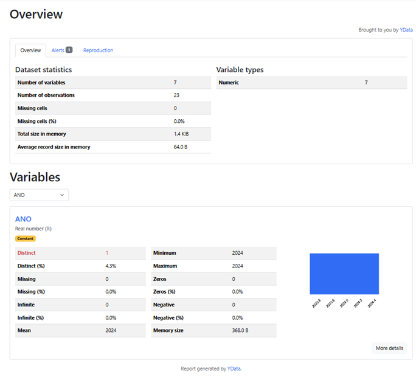
`Ydata-Profiling output for ANO variable in manual read mode (.html)`

Figure below shows one of the possible outputs of the `.html` report. In this case, the figure shows the `MES` distribution readings across the year for manual readings.
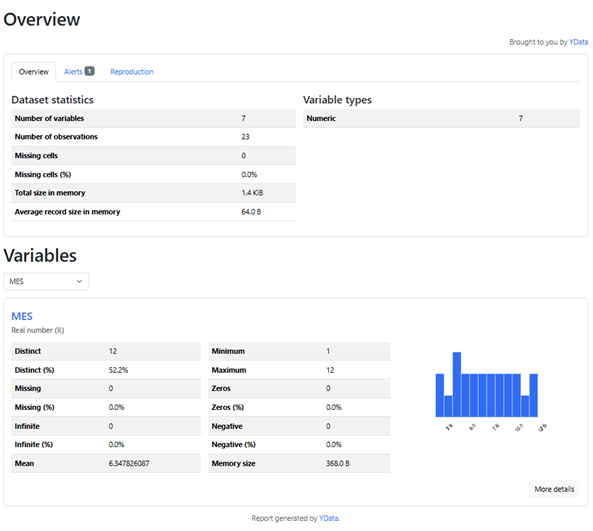
`Ydata-Profiling output for MES variable in manual read mode (.html)`

Figure below shows one of the possible outputs of the `.html` report. In this case, the figure shows the `DIA` distribution readings across the year for manual readings.
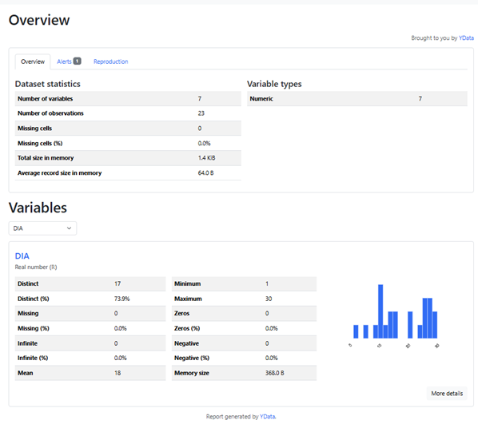
`Ydata-Profiling output for DIA variable in manual read mode (.html)`

Figure below shows one of the possible outputs of the `.html` report. In this case, the figure shows the `HORA` distribution readings across the year for manual readings.
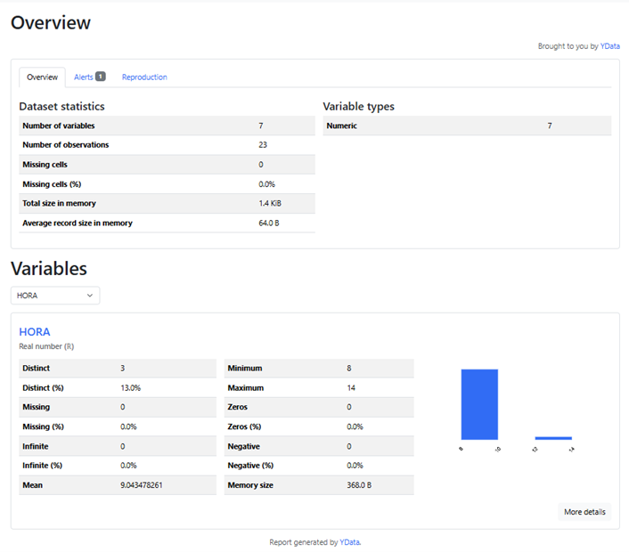
`Ydata-Profiling output for HORA variable in manual read mode (.html)`

Figure below shows one of the possible outputs of the `.html` report. In this case, the figure shows the `MINUTO` distribution readings across the year for manual readings.
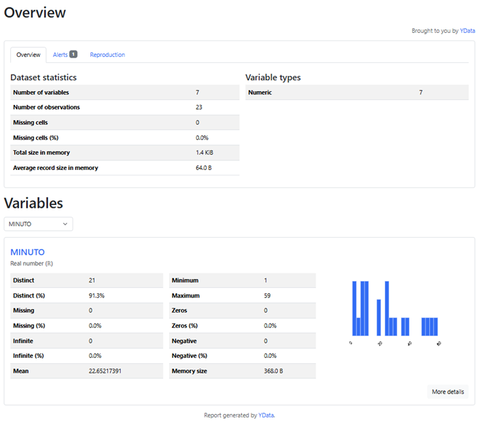
`Ydata-Profiling output for MINUTO variable in manual read mode (.html)`

Figure below shows one of the possible outputs of the `.html` report. In this case, the figure shows the `DESLOCRADIALABS` distribution readings across the year for manual readings.
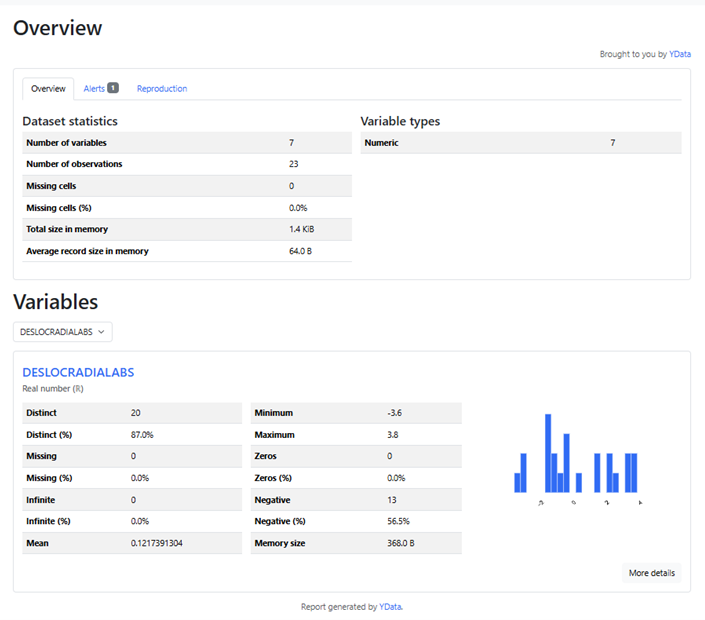
Figure 36. Ydata-Profiling output for DESLOCRADIALABS variable in manual read mode (html)`

Figure below shows one of the possible outputs of the `.html` report. In this case, the figure shows the `DIA` distribution readings across the year for manual readings.
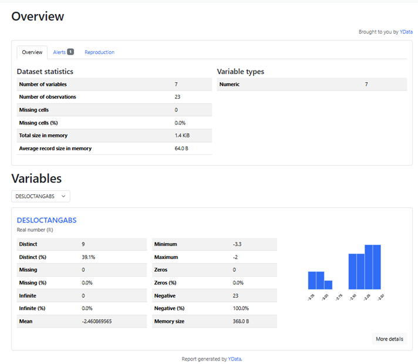
`Ydata-Profiling output for DESLOCTANGABS variable in manual read mode (.html)`

Table below represents the output of the year-month Profiling, showing the manual readings distribution for the different months for 2024. The output is automatically sorted by `DATA_MONTH` field, representing the month first day of the month.

| PLUMBLINE | READ_MODE | YEAR_MONTH_STR | DATA_MONTH | TOTAL_RECORDS |
| :--- | :--- | :--- | :--- | :--- |
| 00000 | manual | 2024_January | 2024-01-01 | 2 |
| 00000 | manual | 2024_February | 2024-02-01 | 1 |
| 00000 | manual | 2024_March | 2024-03-01 | 3 |
| 00000 | manual | 2024_April | 2024-04-01 | 2 |
| 00000 | manual | 2024_May | 2024-05-01 | 2 |
| 00000 | manual | 2024_June | 2024-06-01 | 2 |
| 00000 | manual | 2024_July | 2024-07-01 | 2 |
| 00000 | manual | 2024_August | 2024-08-01 | 2 |
| 00000 | manual | 2024_September | 2024-09-01 | 2 |
| 00000 | manual | 2024_October | 2024-10-01 | 2 |
| 00000 | manual | 2024_November | 2024-11-01 | 1 |
| 00000 | manual | 2024_December | 2024-12-01 | 2 |

`.csv output with year-month distribution values for manual reading mode`

Figure below shows the monthly total number of readings registered for 2024.
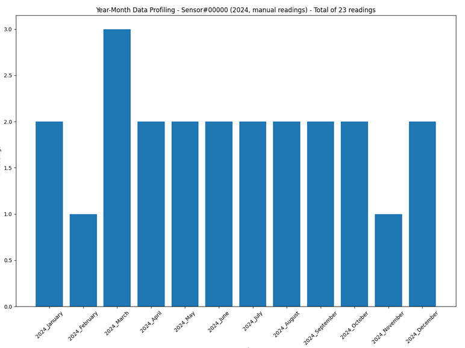
`Year-month distribution visualization for manual reading mode`

### DQ Checks
Below, table describes all output values for each one of the DQ Checks implemented for **Completeness** DQ Dimension in automatic read mode. The `dq_check` column represents the DQ Check and `value` the output calculated value.

| plumbline_id | year | read_mode | dq_dimension | dq_check | value |
| :--- | :--- | :--- | :--- | :--- | :--- |
| 00000 | 2024 | manual | Completeness | days_with_multiple_records_abs | 0.0 |
| 00000 | 2024 | manual | Completeness | days_with_multiple_records_prctg | 0.0 |
| 00000 | 2024 | manual | Completeness | missing_DESLOCRADIALABS_abs | 0.0 |
| 00000 | 2024 | manual | Completeness | missing_DESLOCRADIALABS_prctg | 0.0 |
| 00000 | 2024 | manual | Completeness | missing_DESLOCTANGABS_abs | 0.0 |
| 00000 | 2024 | manual | Completeness | missing_DESLOCTANGABS_prctg | 0.0 |
| 00000 | 2024 | manual | Completeness | missing_data_day_abs | 0.0 |
| 00000 | 2024 | manual | Completeness | missing_data_day_prctg | 0.0 |
| 00000 | 2024 | manual | Completeness | redundant_records_day_abs | 0.0 |

`Data Quality Checks .csv output file for manual read mode - Completeness DQ Dimension`

Next two figures show the different outputs from de DQ Checks calculated for DQ **Dimension** Completeness for manual reading files.
It is possible to check the distribution of records (`Value`) for a specific DQ Check.
The first figura represents “Absolute” DQ Check type, while the second one represents DQ Checks that are “Percentage” type.

Data Quality Checks Reporting output for manual reading mode - Completeness DQ Dimension (Absolute DQ Check Type)
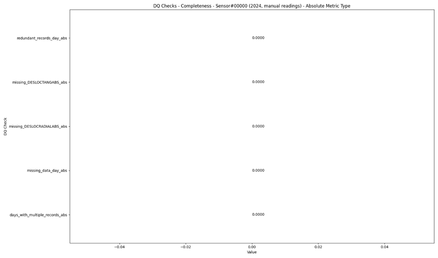
`Data Quality Checks Reporting output for manual reading mode - Completeness DQ Dimension (Absolute DQ Check Type)`

Data Quality Checks Reporting output for manual reading mode - Completeness DQ Dimension (Percentage DQ Check Type)
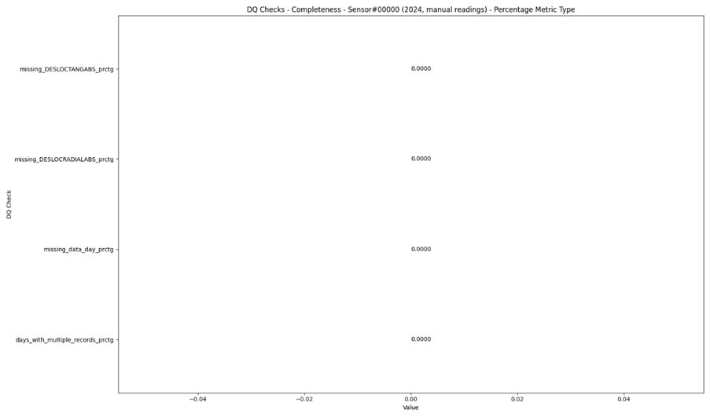
`Data Quality Checks Reporting output for manual reading mode - Completeness DQ Dimension (Percentage DQ Check Type)`

Below table describes all output values for each one of the DQ Checks implemented for **Timeliness** DQ Dimension in manual read mode.
The dq_check column represents the DQ Check and value the output calculated value.

| plumbline_id | year | read_mode | dq_dimension | dq_check | value |
| :--- | :--- | :--- | :--- | :--- | :--- |
| 00000 | 2024 | manual | Timeliness | data_day_density_abs | 0.07 |
| 00000 | 2024 | manual | Timeliness | days_apart_previous_record_count_abs | 9.0 |
| 00000 | 2024 | manual | Timeliness | days_apart_previous_record_proportion_prctg | 0.39 |
| 00000 | 2024 | manual | Timeliness | interval_days_abs | 6.04 |
| 00000 | 2024 | manual | Timeliness | interval_days_prctg | 15.64 |
| 00000 | 2024 | manual | Timeliness | max_gap_days_abs | 39.0 |

`Data Quality Checks .csv output file for manual read mode - Timeliness DQ Dimension`

Next two figures show the different outputs from de DQ Checks calculated for DQ Dimension **Completeness** for manual reading files.
It is possible to check the distribution of records (`Value`) for a specific DQ Check. While first one represents DQ Check “Absolute” type, the second represents metrics that are DQ Check “Percentage” type.

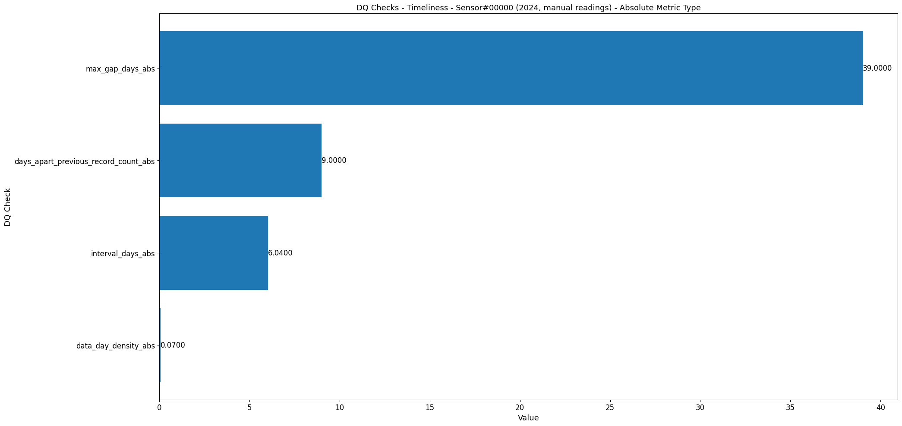
`Data Quality Checks Reporting output for manual reading mode - Timeliness DQ Dimension (Absolute DQ Check Type)`

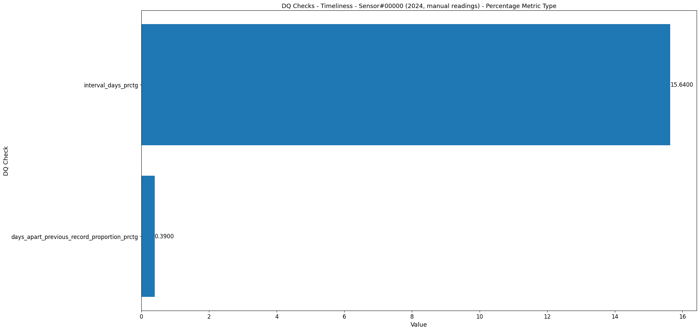
`Data Quality Checks Reporting output for manual reading mode - Timeliness DQ Dimension (Percentage DQ Check Type)`

### Threshold Validator
Table below, represents the `.csv` output file with all the threshold values calculated in this module for **Timeliness** DQ Dimension for manual readings, in `threshold_validator.py` script.
The output has the column `status` showing the defined Alert type based on the `value` output calculated column, that represents the threshold value calculated.
This `value` column is compared with threshold column (value defined in `manual.json` file) and based on the limit factor calculation it raises the Alert type (`status` column).
Additional columns like `threshold_diff` and `threshold_deviation_pct` are in the file. The first column represents the absolute difference between `threshold` value allowed and the `value` calculated, while the second one represents the percentage deviation between `threshold` and `calculated threshold value`.
This value is `100` (meaning 100%) when there is a threshold defined as `0` and a value for the threshold calculated `value` value.

| plumbline_id | year | read_mode | dq_dimension | dq_check | status | value | threshold | threshold_diff | threshold_deviation_pct |
| :--- | :--- | :--- | :--- | :--- | :--- | :--- | :--- | :--- | :--- |
| 00000 | 2024 | manual | Completeness | days_with_multiple_records_abs | OK | 0.0 | 0.0 | 0.0 | 0 |
| 00000 | 2024 | manual | Completeness | days_with_multiple_records_prctg | OK | 0.0 | 0.0 | 0.0 | 0.0 |
| 00000 | 2024 | manual | Completeness | missing_DESLOCRADIALABS_abs | OK | 0.0 | 0.0 | 0.0 | 0 |
| 00000 | 2024 | manual | Completeness | missing_DESLOCRADIALABS_prctg | OK | 0.0 | 0.0 | 0.0 | 0.0 |
| 00000 | 2024 | manual | Completeness | missing_DESLOCTANGABS_abs | OK | 0.0 | 0.0 | 0.0 | 0 |
| 00000 | 2024 | manual | Completeness | missing_DESLOCTANGABS_prctg | OK | 0.0 | 0.0 | 0.0 | 0.0 |
| 00000 | 2024 | manual | Completeness | missing_data_day_abs | OK | 0.0 | 0.0 | 0.0 | 0 |
| 00000 | 2024 | manual | Completeness | missing_data_day_prctg | OK | 0.0 | 0.0 | 0.0 | 0.0 |
| 00000 | 2024 | manual | Completeness | redundant_records_day_abs | OK | 0.0 | 0.0 | 0.0 | 0 |

`Threshold Validator.csv output file for manual read mode - Completeness DQ Dimension`

Below, figures represent the Alert distribution by Alert type. Different visualizations are created accordingly the DQ Check type, allowing the different DQ Check type (Absolute and Percentage) to be analysed in their specific report.
Both figures apply to manual read mode for **Completeness** DQ Dimension.

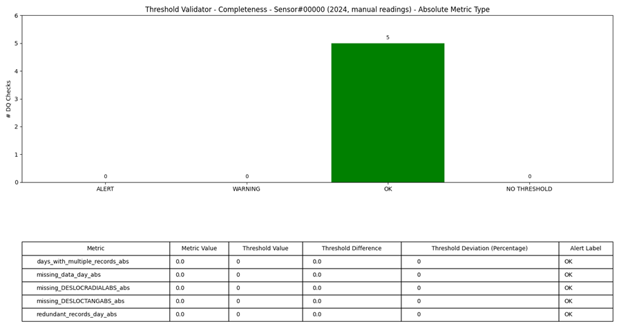
`Threshold Validator Reporting output for manual reading mode - Completeness DQ Dimension (Absolute DQ Check  type)`

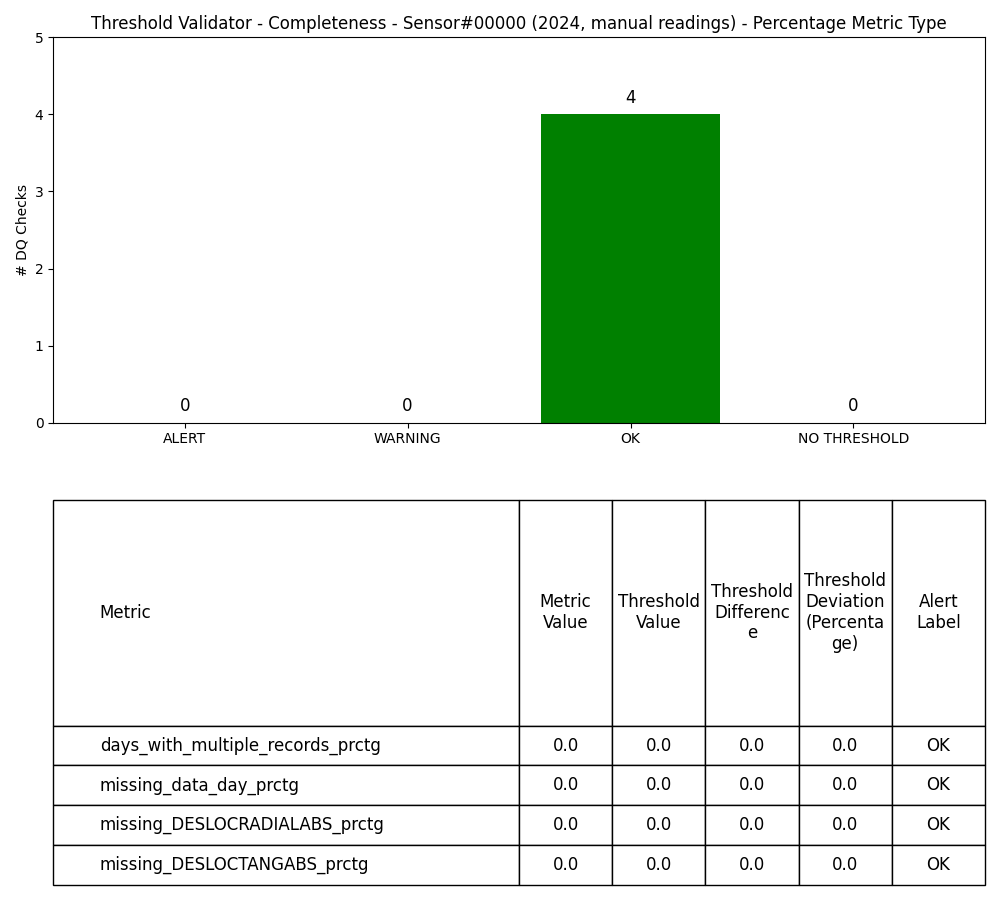
`Threshold Validator Reporting output for manual reading mode - Completeness DQ Dimension (Percentage DQ Check type)`

Table below, represents the `.csv` output file with all the threshold values calculated in this module for **Timeliness** DQ Dimension for manual readings, in `threshold_validator.py` script.
The output has the column `status` showing the defined Alert type based on the `value` output calculated column, that represents the threshold value calculated.
This value column is compared with `threshold` column (value defined in `manual.json` file) and based on the limit factor calculation it raises the Alert type (`status` column).
Additional columns like `threshold_diff` and `threshold_deviation_pct` are in the file.
The first column represents the absolute difference between `threshold` value allowed and the `value` calculated, while the second one represents the percentage deviation between `threshold` and calculated threshold value.
This value is `100` (meaning 100%) when there is a threshold defined as `0` and a value for the threshold calculated `value` value.

| plumbline_id | year | read_mode | dq_dimension | dq_check | status | value | threshold | threshold_diff | threshold_deviation_pct |
| :--- | :--- | :--- | :--- | :--- | :--- | :--- | :--- | :--- | :--- |
| 00000 | 2024 | manual | Timeliness | days_apart_previous_record_count_abs | ALERT | 9.0 | 1.0 | 8.0 | 800.0 |
| 00000 | 2024 | manual | Timeliness | days_apart_previous_record_proportion_prctg | ALERT | 0.39 | 0.0 | 0.39 | 39.0 |
| 00000 | 2024 | manual | Timeliness | interval_days_prctg | ALERT | 15.64 | 0.0 | 15.64 | 1564.0 |
| 00000 | 2024 | manual | Timeliness | max_gap_days_abs | ALERT | 39.0 | 0.0 | 39.0 | 100.0 |
| 00000 | 2024 | manual | Timeliness | data_day_density_abs | OK | 0.07 | 0.07 | 0.0 | 0.0 |
| 00000 | 2024 | manual | Timeliness | interval_days_abs | OK | 6.04 | 14.0 | 7.96 | -56.86 |

`Threshold Validator.csv output file for manual read mode - Timeliness DQ Dimension`

Below, figures represent the Alert distribution by Alert type. Different visualizations are created accordingly the DQ Check type, allowing the different DQ Check type (Absolute and Percentage) to be analysed in their specific report. Both figures apply to manual read mode for **Timeliness** DQ Dimension.

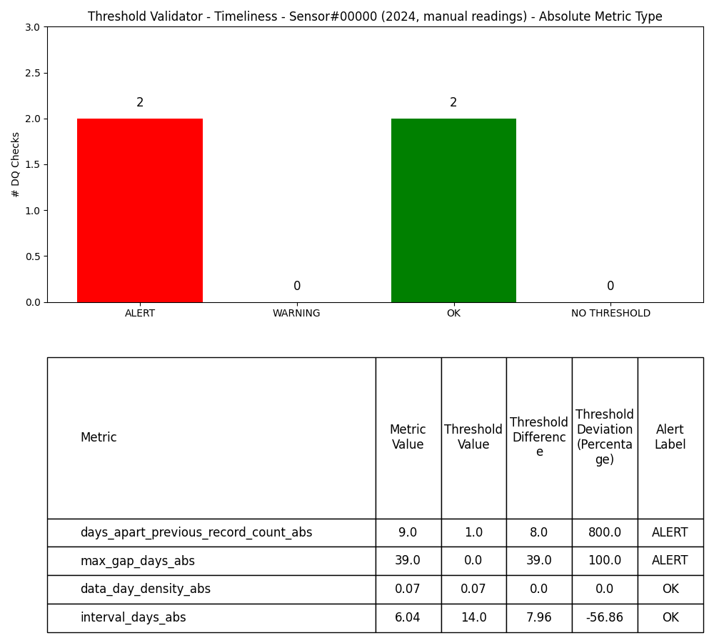
`Threshold Validator Reporting output for manual reading mode - Timeliness DQ Dimension (Absolute DQ Check  type)`

`Threshold Validator Reporting output for manual reading mode - Timeliness DQ Dimension (Percentage DQ Check type)`

Nex two figures represent respectively Monthly Average Radial Displacement and Monthly Average Tangential Displacement.
For both, in the same chart are represented in a violin plot the distribution of the monthly values for each of the variables, combined with the blue line representing the average value for each values: first figure uses `DESLOGRADIALABS` column data and second uses `DESLOCTANGABS` column data.

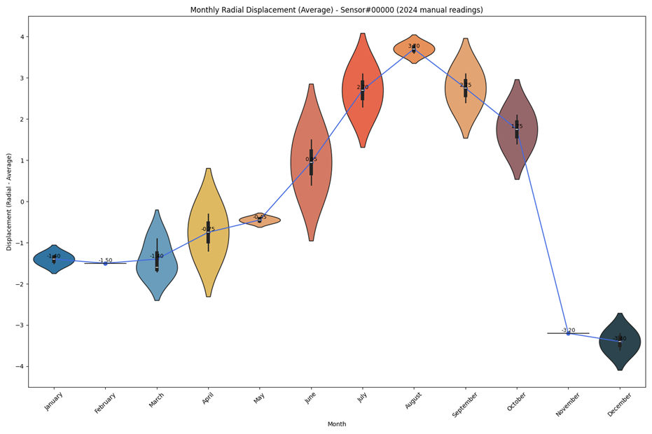
`Monthly Average Radial Displacement for manual reading mode`

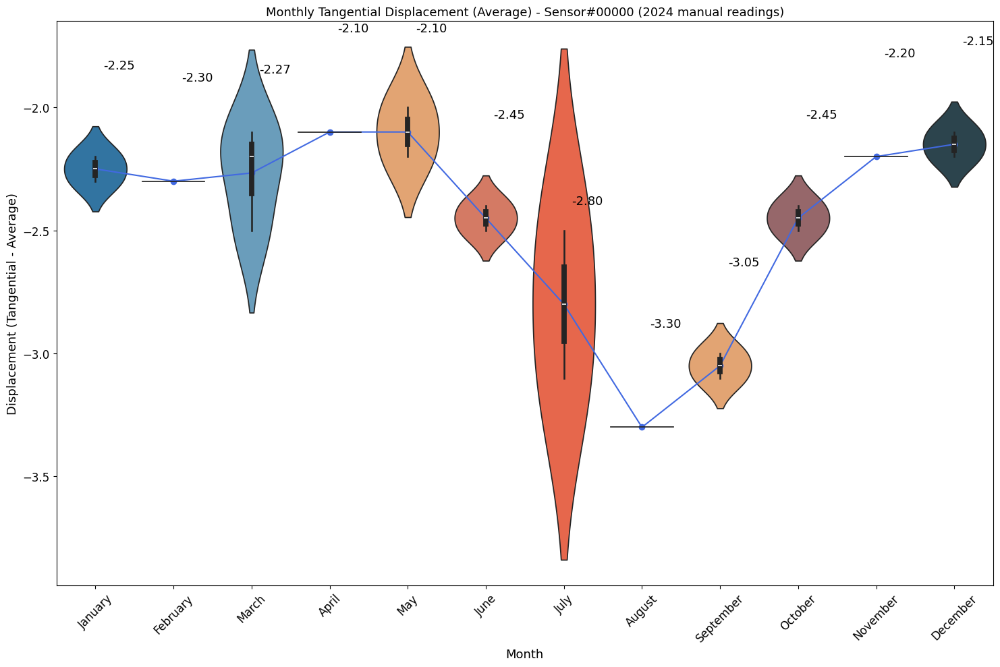
`Monthly Average Tangential Displacement for manual reading mode`

